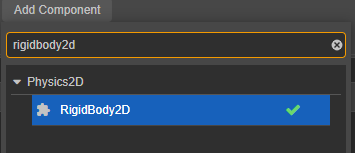

拧螺丝游戏的关卡一般不是自动算法生成，因为不太有规律，图形太多，硬是要写代码来生成，可能不如手动。这个游戏之前讲过主要是用物理引擎来实现，可以看看之前的文章。这篇文章拖得有点久了，这次把怎么制作一个完整的关卡过程来讲讲，之前讲过板子上的洞是通过算法来挖洞的，其实也可以不用算法来实现，简单粗暴一块一块组合起来，真是太机智了。

1、打开电脑，https://www.cocos.com/ 下载cocosdashboard

2、第二步打开cocosdashboard，下载3.8.3引擎

3、新建一个项目，取个响亮的名字：拧螺丝我最牛逼

4、把老婆给我们准备好的素材导入引擎，没有老婆的话可以找女朋友要。

5、准备制作钉子，拖入钉子图片到图层上

6、给钉子添加物理组件，点击 **属性检查器 **的 **添加组件 **按钮，输入 **Rigidbody2D** 即可以添加 2D 刚体组件。设置属性如下图（更多属性介绍可以看https://docs.cocos.com/creator/3.8/manual/zh/physics-2d/physics-2d-rigid-body.html）：

除了要添加2D刚体组件之外，还还添加碰撞体，碰撞体描述了刚体的轮廓。如上的cc.CircleCollider2D，半径设置为22像素。更多请看https://docs.cocos.com/creator/3.8/manual/zh/physics-2d/physics-2d-collider.html

7、接下来要制作板子，把板子图片拖到图层上

计划给这个板子安装三个钉子，那先给它打三个孔，不然没地方拧螺丝钉，所以先要制作孔。

8、螺丝孔设计如下，两个图片素材，一个灰圆，一个白圆环，就非常的逼真了，命名为 hole

制作好后，将这个孔节点拖到资源管理器中，搞成预制体

9、给板子加孔，加上三个孔，拖三个hole预制体到板子图层上，效果就非常牛逼了

10、围绕给板子添加多个物理组件，空出三个孔，上图绿色边框的矩形，就是物理碰撞体的描边。这样做目的就是让板子能够挂在螺丝钉上，如果这三个孔都有螺丝钉，板子就掉不下去了。

同时要给板子添加物理组件，因为螺丝没了，它要掉下去

11、制作更多形状的板子，比如

花了半天，制作了很多几十块板子，这技术太精湛了。

12、有了这么多板子，那么就可以随意组合出你想要的任何样子了

那么就成了最后的关卡，所有的关卡都搞成预制体，这样就可以动态加载，其实这本质就是一个配置文件。

13、有了板子关卡，那么钉子在哪里？别慌，钉子要用代码来生成了。下载安装VSCode，百度输入 "vscode"，点击官网，点击下载，点击 windows，就下载好了，直接双击，下一步，下一步，下一步，下一步，安装，完成。

14、在cocos中新建一个脚本LevelAction

双击脚本，用vscode打开，纳尼？cocos不支持代码编辑？？对的，就是不支持

首先先把板子关卡渲染出来，根据关卡等级，获取对应的预制体。代码如下

可以给板子和螺丝钉定义一批颜色，那么设置下随着关卡越来越大，颜色也越来越多，让牛逼的玩家觉得自己很牛逼，彻底的沉醉在你开发的游戏里。

有了颜色，有了关卡，那么就可以给钉子设置一下颜色，获取钉子总数，因为钉子是三个一组，所以遍历一下。定义在每块板子上颜色要随机分布，这样就可以增加游戏的难度。

初始化钉子，实例化钉子的预制体，group\_id是物理碰撞体组件的层级，意思就是让不同板子和钉子分层，不会互相干扰。

这样就完成了一个关卡的制作了。

逻辑的点击事件，和之前分享的花朵叠叠叠游戏是类似的，就不在介绍了。最后的效果

[luosi.mov](files/luosi.mov)

代码的部分采用图片的方式，这样也可以避免大家复制粘贴，逼着大家自己写，何尝不是一种倒逼。

如果光看文字图片介绍不会做，还出现各种报错，可以进知识星球，获取源码，星球内部提供星主的亲自答疑。

