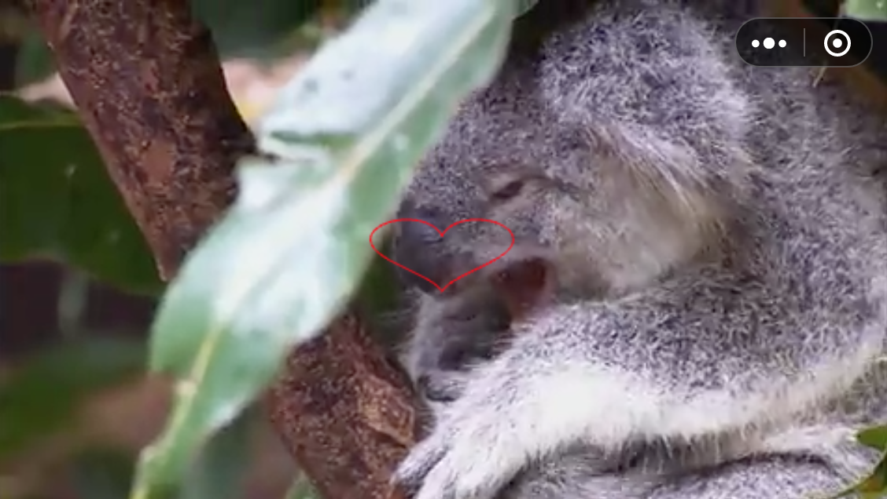

# 《完蛋！我被美女包围了！》开发详解
最近《完蛋了！我被美女包围了！》游戏大热，这可能会是一个转折点，加上近期短剧本身也成为一种掘金热潮，后续真人互动视频类游戏可能会成为趋势，那么以Cocos Creator和小游戏为例，来看看这种游戏实现的难易程度。

视频播放在web环境本身就是个难点，包括自动播放、全屏播放在不同的设备下表现不同，兼容性也是一大痛点。因为我用的比较多的是cocos引擎，所以也用它写了一个Demo，并且也兼容适配了微信，直接看[demo](https://wxgame.fun/static/game-video/)。

## **Cocos Creator**

3.x版本和2.x版本的还是有点差别，包括编辑器和API。我发现在3.x版本是Content Size 无法改变视频的尺寸，只能渲染出视频本身的宽高，研究了很久都没有发现哪里姿势不对切换到2.x就能直接设置宽高尺寸，可以很好的铺满手机屏幕。3.x版本的引擎无奈之下只能将游戏的尺寸设置为视频的尺寸大小。

3.x的截图

制作完游戏Demo后跑在不同的平台上看看效果如何，首先来看下Web浏览器。

##

## **Web 浏览器**

在Cocos Creator 中新建一个项目，拖拽一个视频标签，设置远程播放地址，会踩到以下几个坑：

* 有的视频好像无法播放，比如https://router.polyv.net/proxy/mpv.cuplayer.net/e8888b74d1/3/e8888b74d18c3a08379f38d27db9c693\_1.mp4  ，一直黑屏，不知道是不是需要转码。

* fullScreenOnAwake全屏属性无效

有的设备也会报下面的错：Failed to execute 'requestFullscreen' on 'Element': API can         only be initiated by a user gesture.

* 其次是Play on Awake自动播放很迷，同一台设备有的时候可以有的时候不行。索性就别自动播放，全部由用户点击播放也能解决问题。

* 即使手动点击调用play()，也会概率出现以下错误：Uncaught (in promise) DOMException: play() failed because the user didn't interact with the document first.

* readyToPlay触发的时机是个谜，时有时无。

#### **UI在VideoPlayer上面**

在2.x引擎编辑器上面，可以通过以下步骤实现：

可通过以下三个步骤实现 UI 在 VideoPlayer 上显示：

1. 开启 cc.macro.ENABLE\_TRANSPARENT\_CANVAS = true（设置 Canvas 背景支持 alpha 通道）。但需要注意的是这句代码要写在组件逻辑之外，写在start 或者onload或者其他生命周期函数内是无效的。

2. 在属性检查器中设置摄像机的 backgroundColor 属性透明度为 **0**。坑点注意：摄像机背景色只能是黑色，否则叠加效果有半透明蒙层。

* 在属性检查器中勾选 VideoPlayer 组件上的 **stayOnBottom** 属性。

**注意**：

* 该功能仅支持 **Web** 平台。

* 各个浏览器具体效果无法保证一致，跟浏览器是否支持与限制有关。

* 开启 **stayOnBottom** 后，将无法正常监听 VideoPlayerEvent 中的 clicked 事件。

在3.x以上的编辑器，第一步则要在项目模块设置，其他两步是一样的。

下面是游戏的运行效果，白色Node就是叠加在视频上。

以上就是Web平台的坑点和注意事项。在Web上视频能够播放，可一旦构建编译到微信小游戏就黑屏，要不就只有声音没有画面，不管是3.x还是2.x都存在一些问题，猜想VideoPlayer没有兼容好小游戏环境。官方的文档写的不够明确，有点模棱两可。

## **微信小游戏**

Cocos Creator 引擎的VideoPlayer组件并不能在微信小游戏环境下能够正常的渲染出来。那么只能去看看微信官方的文档，关于视频的接口只有一个wx.createVideo，所以能做的事情就是围绕这个接口。

创建一个视频的代码如下：

视频的参数很多，就不一一展开介绍，具体可以参考官方的文档，<https://developers.weixin.qq.com/minigame/dev/api/media/video/wx.createVideo.html>

下面说下容易踩坑的地方。

**如何全屏**

在不调用requestFullScreen接口的情况下，也可以做到全屏，设置坐标为0，并且width和height为手机的屏幕宽高，然后objectFit的值为cover，这样视频能够铺满，但是会裁剪一些边缘细节。调用requestFullScreen的问题是有一个很明显的过渡效果，对于游戏来肯定是无法接受的，个人看来用处只限于切换横竖屏。

**自动播放**

如果不设置autoplay，并没有类似canPlay的方法告诉你视频可以播放了。提前调用了video.play()会导致没任何反应，可以尝试延迟1s左右调用play()方法。

**视频地址**

微信小游戏播放视频的接口不支持本地播放，src改成网址链接就可以正常播放。

**视频层级**

视频默认是覆盖在canvas上的，API也可以设置在下面underGameView为true的时候视频就在底下。但是光这只这个参数还不够，还需要搭配canvas做一些事情。canvas本身是要透明的，而且只有webgl模式才能行得通，理论上是跟Cocos Creator 设置是一样的逻辑。alpha为true即可：

下一步就是设置画布的背景色

满足这个三个条件就可以让canvas画布的内容叠加在视频上。

效果可以看这个demo的截图，在视频上画一个红心

## **抖音小游戏**

抖音Video对象的接口比微信侧要丰富一些，具体可以看官方文档。这里只挑几个重点看看。

#### **将视频帧绘制到canvas上**

图片来自抖音

`Video.paintTo(canvas, dx, dy, sx, sy, sw, sh)`

将当前视频内容绘制到指定 canvas，很好的一种思路，这样就不用考虑层级的问题。

提供了onCanplay方法，比微信进步了。但没有提供设置层级的方法，看来没有办法，在抖音上只能考虑将视频帧绘制到canvas上。

所以三个平台处理的方法各自不同，这对开发者来说真是噩梦啊。以上就是基础技术储备，下面看游戏的实现思路。

## **游戏实现**

那么来看下怎么实现互动类的游戏，基本思路就是视频和游戏交互结合。把视频拆分成多段，根据用户的交互选择播放对应的视频片段。整体技术含量并不高，对内容本身要求更高。

播放完视频后隐藏，然后切回到游戏界面，等待用户交互，然后继续播放下一个视频。需要考虑以下两个点：

* 视频和交互界面的衔接

* 视频的预加载

大概流程就是这样，每一个视频搭配一个交互界面。合适的做法是制作一个预制组件，将逻辑高度抽象。交互界面提供一个List选项，每个选项对应一个播放地址，这样就可以串联整个故事。在交互界面可以添加额外的逻辑，比如角色的亲密度计算等等。

总之这种游戏的开发难度不高，难点在于游戏的视频内容编剧。

## **总结**

视频组件的坑还是挺多的，不过不建议在web平台上做此类游戏，兼容性可能得花很多时间。手机上自动播放iOS很多都不支持。PC上的自动播放时好时坏。所以建议直接上微信或者抖音平台。

另外需要注意的是3.x的引擎和2.x的引擎事件有点差异，建议直接用官网的接口。Node.EventType.TOUCH\_START 底层枚举值是touch-start  ，而非系统的touchstart，导致事件一直没有响应。

如果需要源码请关注公众号获取。

