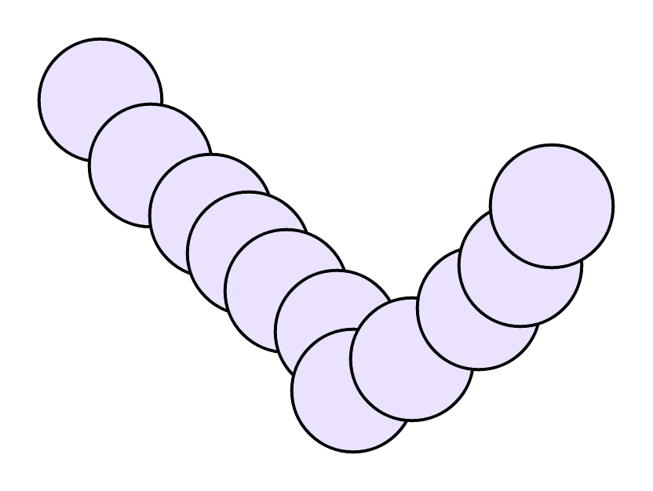
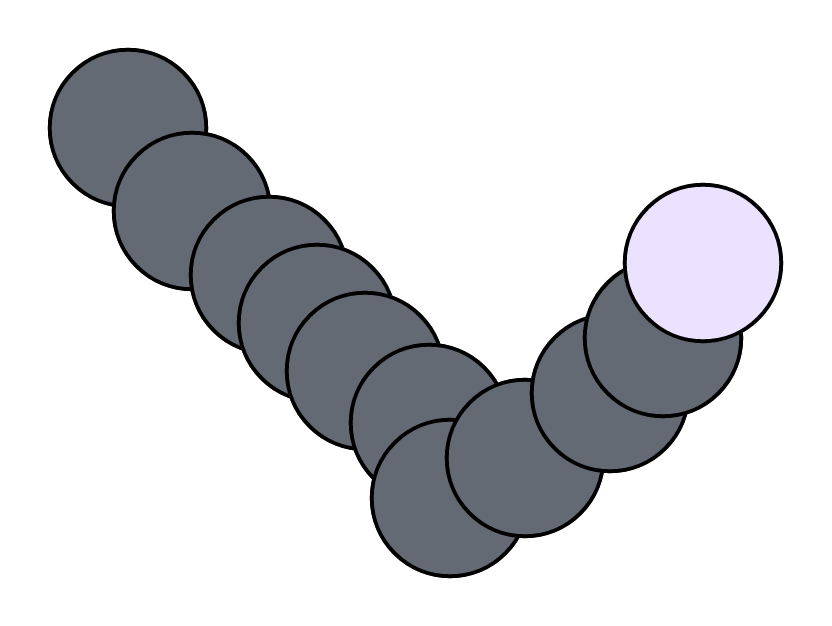

这个游戏在微信小游戏畅玩榜已经有一阵子了，在上榜单的时候也观察了这款游戏，这个游戏到底是怎么实现呢？玩法有点类似《羊了个羊》，但又有点差异。相同的地方是三消游戏，找到相同的三个元素就可以完成消除。差异点是这个游戏的堆叠逻辑不一样，因为每一关都是不同的地图。堆叠地图明显是经过人为设计过，不像《羊了个羊》那么随机，虽然羊也被设计，但显得更加无规律。

那怎么可以简化地图生成的复杂度呢？可以摆放出任意的造型，而又保证游戏的堆叠逻辑。琢磨了很久，发现其实很简单。判断是否发生堆叠的逻辑就是是否发生碰撞。

## 花朵堆叠



刚好在文档编辑器中可以画图比较好示意，如上图，创建多个圆形，本身就是有层级关系，那么最终的效果就有堆叠的效果。只要将压在下面的圆换个深度颜色就可以，在cocos中给Node节点设置一个color颜色来表示遮罩效果。



在地图编辑器中，创建N个圆，可以得知圆的半径和【x, y】坐标位置信息。最终给到前端引擎渲染的时候是一个数组列表，因为本身数组就自带了层级信息，所以省去了ZIndex。前端引擎遍历数组列表批量创建精灵节点。那怎么判断要不要给节点加上遮罩颜色呢？用碰撞检测就行，从第一个节点开始，跟后面的节点比较是否发生碰撞。所以前面节点是否被遮挡取决于后面的节点有没有与自己叠加，这样看起来也比较合理，没有与任何节点碰撞就认为是最高层级，可以被点击消除。以下代码简要示意了碰撞逻辑：

```javascript
for (let e = 0, t = this.flowerNodeList.length; e < t; e++) {
    let node = this.flowerNodeList[e];
    if (node) {
        let pos = v2(node.worldPosition.x, node.worldPosition.y), 
            width = node.getComponent(UITransform).width / 2;
        node.getComponent(Flower).isMask = false;
        for (let a = e + 1; a < t; a++) {
            let node1 = this.flowerNodeList[a];
            if (node1) {
                let pos1 = v2(node1.worldPosition.x, node1.worldPosition.y);
                // 碰撞了就堆叠了
                if (Intersection2D.circleCircle(pos, .88 * width , pos1, .88 * width)) {
                    node.getComponent(Flower).isMask = true; // 设置遮罩
                    break;
                }
            }
        }
    }
}
```

只要加上这个逻辑就能渲染出带有堆叠效果的地图。生成的地图数量要保证刚好是3的倍速，否则是死局。

在顶层的花朵被点击移除后，重新计算一次碰撞逻辑可以获得最新的顶层节点，直到最后所有的节点被消除。


## 消除的逻辑

有两层，一个是等候区，一个是花盆区。

核心就是花朵的位置变化和消除判断。

如果当前点击花朵的颜色与花盆颜色匹配，则直接将节点添加到花盆上。位置移动之前的游戏也讲过了，就是统一换算到世界坐标系下，不再赘述。如果没有匹配到花盆的颜色，就放入等候区，等候区的数量是有限制的，如果等候区满了，且无法继续打包新的花盆，则游戏失败。花盆上花朵的位置可以放置三个空节点，花盆的目标花色随机从剩余的花池中随机一种。如果当前没有可合成的，玩家可以借助道具。


## 四种道具

* 打包花盆：取一个花盆，从花池中取出颜色匹配的花朵，完成打包即可。

* 清空等待区：这个逻辑需要注意的是等候区的数量不一定是3的倍数，因此需要在花池中补齐剩余的花朵，同时要更新一下消除的进度。

* 花池随机颜色：获取已有的花池ID列表，乱序，然后重新赋值给每朵花。

* 添加新花盆，因为本身花盆就是预制体，初始化花盆数量是2个，新增就直接在花盆队列中新增一个，后续花朵会自动被添加到花盆上。


以上就是核心的花朵堆叠渲染和消除逻辑，在开发过程中，还遇到一点比较有意思的地方，就是消除花朵解锁花束的进度实现。简单理解就是一个进度条progressbar，但这个进度条的纹理又是动态变化的，因为不同关卡要解锁的花束是不一样的。如果是静态的纹理处理方式比较简单，利用遮罩组件。花束的节点颜色设置为黑色，那整束花就变成未知了，保留外型。然后父容器添加一个遮罩组件，遮罩类型为矩形，动态改变遮罩的宽高，底部再叠加一个原花束的节点，整体实现思路是比较绕一点。问题是动态设置纹理后，裁剪不太准确。后面尝试另外一种方式。


然后就是消除花朵的拖尾实现，如果想简单点，cocos本身就提供了拖尾的组件[MotionStreak（拖尾）组件参考](https://docs.cocos.com/creator/manual/zh/editor/components/motion-streak.html)，使用非常容易。需要更加精细的粒子效果需要另外开发，或者用骨骼动画。


最后就是花束列表，这里如果列表节点非常多，则会比较卡，比较好的做法是用虚拟列表，开源社区也有比较成熟的组件（https://github.com/gh-kL/cocoscreator-list）。目前我还没来得及做，后面优化。


最后可以体验一下游戏，跟原版细节上有些差异，但可以继续调优。


欢迎关注我的公众号，获取更多游戏开发知识和游戏源码，手把手教你做游戏。         

