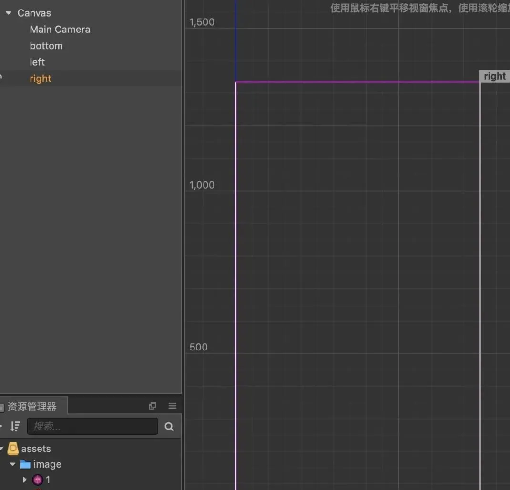
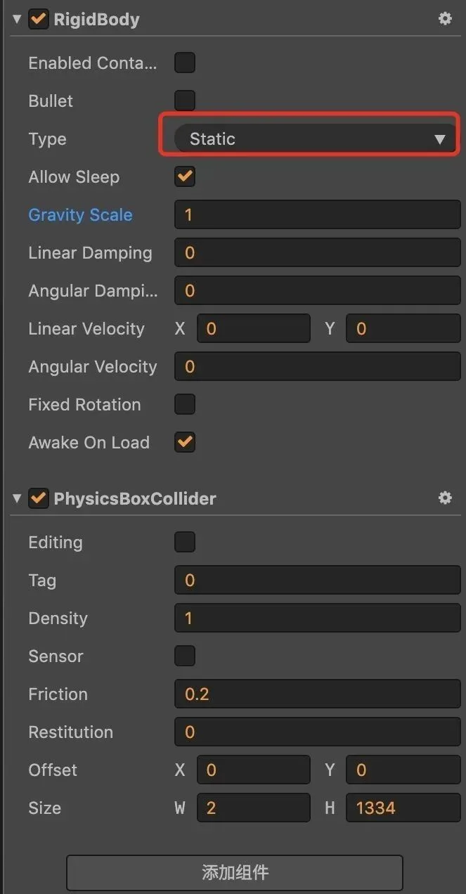
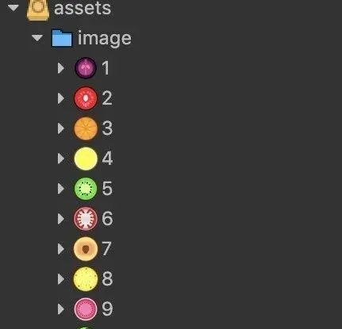
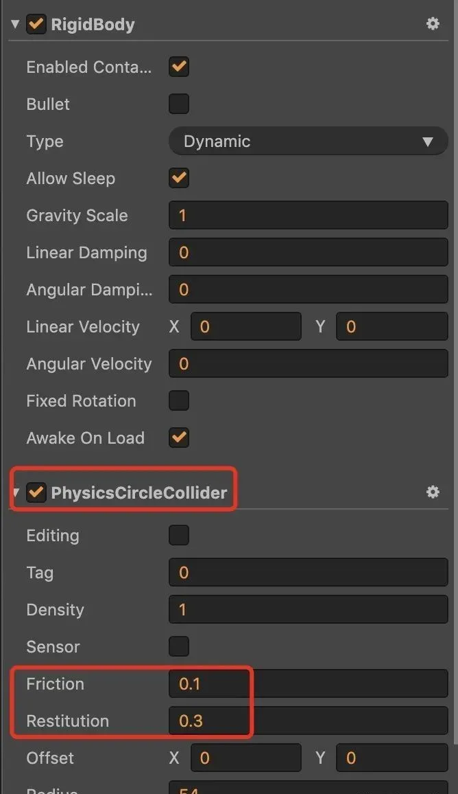
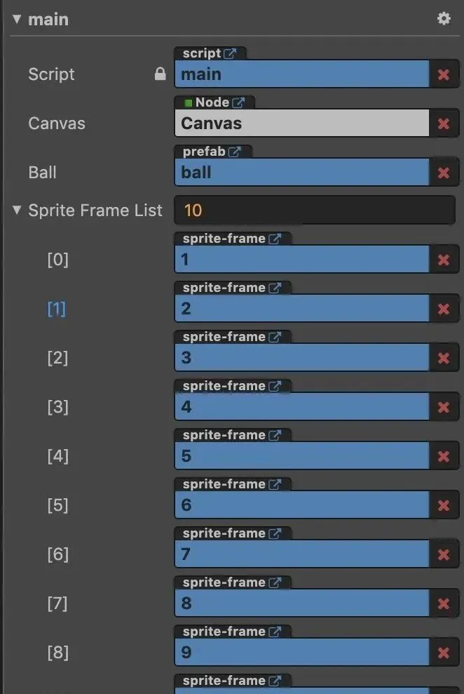

今天抽空跟大家分享一下用Cocos Creater怎么制作类似《合成大西瓜》这样的游戏。游戏的素材我这里先直接用原版的给大家演示。

，时长00:19


首先来拆解一下游戏。游戏的玩法比较简单，点击屏幕，生成一个水果。相同的水果碰撞，合成更高等级的水果，获得分数。然后就是一个特效，播放声音等。

简单总结就是：点击 => 碰撞 => 计分 => 展示

注意：水果是带有物理效果。

核心玩法就是：

1、物理模型与物理世界

2、动态随机生成水果

3、相同水果碰撞升级

## 一、搭建物理世界



拖三个节点到画布上，设置他们的尺寸刚好能够作为左右下的边界，贴合游戏的设计尺寸。并且在这三个节点上添加物理组件（Box类型），设置为静态刚体。



这样游戏的边界就做好了，水果就不会出去。

## 二、动态随机生成水果

主要是利用Cocos Creater的动态创建节点的能力。游戏有以下素材：



拖动一个节点到画布上，然后将其作为预制体。要给预制体节点添加物理组件，类型得是圆形，设置弹性和摩擦系数，如下：




那么接下来的逻辑就是怎么动态创建它。

1、定义三个属性：当前的画布节点，预制体ball，水果图List

2、在onLoad逻辑中开启物理引擎，设置一个合适的重力大小。

3、提前预设每个水果的轮廓大小。

4、给画布绑定touch事件

5、处理手指touch事件，获取手指坐标，随机创建新的节点，添加到场景，并且设置坐标和纹理。

直接上代码：

```javascript
cc.Class({
    extends: cc.Component,

    properties: {
        canvas: {
            default: null,
            type: cc.Node
        },
        ball: {
            default: null,
            type: cc.Prefab
        },
        spriteFrameList: {
            default: [],
            type: [cc.SpriteFrame]
        }
    },
    onLoad () {
        cc.director.getPhysicsManager().enabled = true;
        cc.director.getPhysicsManager().gravity = cc.v2(0, -2000);
        const radius = [26, 40, 54, 60, 76, 91, 92, 127, 150, 200];

        this.canvas.on(cc.Node.EventType.TOUCH_START, function (event) {
            let position = event.getLocation();
            let index = ~~(Math.random() * (this.spriteFrameList.length - 6));
            let scene = this.canvas;

            let node = cc.instantiate(this.ball);
            node.parent = scene;
            node.setPosition(position.x - 375, 550);
            node.friutNumber = index;

            let sprite = node.getComponent(cc.Sprite);
            sprite.spriteFrame = this.spriteFrameList[index];
            
            // 调用apply以后才会重新生成box2d的相关对象
            let collider = node.getComponent(cc.PhysicsCircleCollider);
            collider.radius = radius[index];
            collider.apply();
        }, this);
    }
});
```

将上面的代码绑定到当前的画布节点上，并设置相关属性



现在点击画布是可以动态创建了，并且会掉落在地板上。那么接下来就是处理合成升级的功能。

## 三、相同水果碰撞升级

前面我们给水果添加了一个属性friutNumber，代表了水果当前的等级

```plain&#x20;text
node.friutNumber = index;
```

所以合成的逻辑很简单是不是，判定发生碰撞的水果的等级是不是一样就行了。然后销毁其中一个，升级其中一个。

直接上代码：

新建一个脚本绑定到预制体节点，定义一个属性spriteFrameList，设置为水果纹理，提供给升级的时候改变纹理用。

在onBeginContact处理物理碰撞的回调：

1、每对碰撞体会执行两次onBeginContact，但只处理一次

2、升级的时候要同步物理模型的尺寸

3、升级后要销毁其中一个

```javascript
cc.Class({
    extends: cc.Component,

    properties: {
        spriteFrameList: {
            default: [],
            type: [cc.SpriteFrame]
        }
    },
    onBeginContact: function (contact, selfCollider, otherCollider) {
        let selfNode = selfCollider.node;
        let otherNode = otherCollider.node;

        let selfNumber = selfNode.friutNumber;
        let otherNumber = otherNode.friutNumber;
        let radius = [26, 40, 54, 60, 76, 91, 92, 127, 150, 200];

        if(otherNumber !== undefined && selfNumber !== undefined && selfNumber === otherNumber && otherNumber < 10 && otherNumber < 10 && !contact.disabled){
            contact.disabled = true;
            let selfCollider = otherNode.getComponent(cc.PhysicsCircleCollider);
            let otherCollider = otherNode.getComponent(cc.PhysicsCircleCollider);
            
            selfCollider.radius = 0;
            selfCollider.apply();
    
            let action = cc.moveTo(0.1, otherNode.position.x, otherNode.position.y);
            
            let finished = cc.callFunc(function () {
                selfNode.destroy();
                otherNode.friutNumber++;
                otherCollider.radius = radius[otherNode.friutNumber];
                otherCollider.apply();
                otherNode.getComponent(cc.Sprite).spriteFrame = this.spriteFrameList[otherNode.friutNumber];
            }, this);
            selfNode.runAction(cc.sequence(action, finished));
        }
    }
});
```


当然这只是核心玩法而已，更多细节和参数需要完善。

欢迎关注我的公众号，获取更多游戏开发知识和游戏源码，手把手教你做游戏。         

