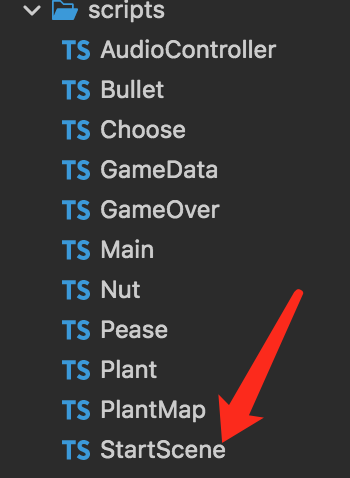
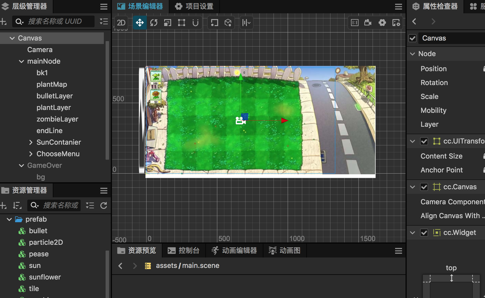
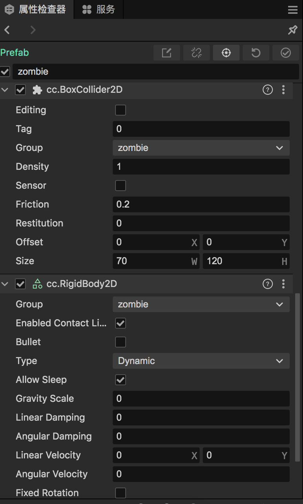
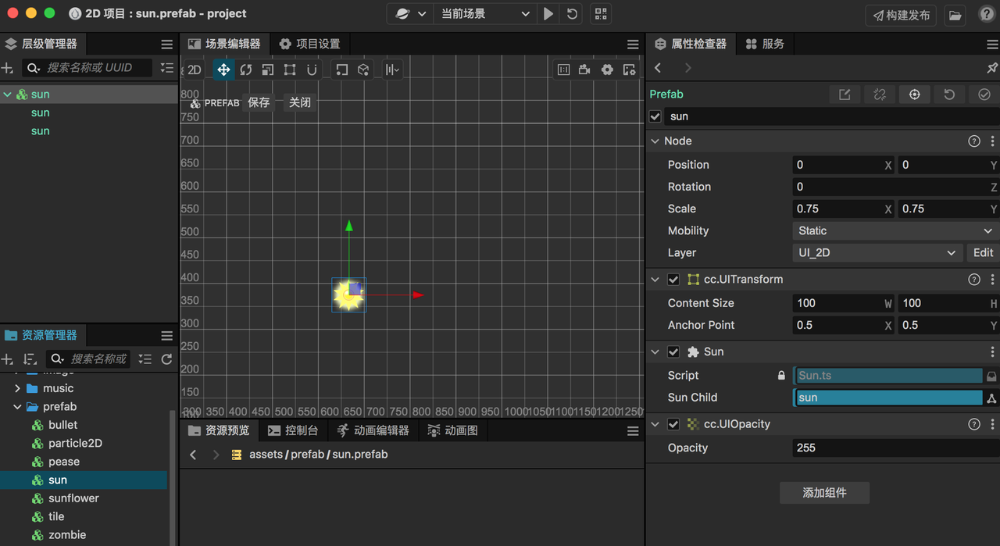

植物大战僵尸本质是一个塔防游戏，本游戏Demo虽然比较简略，但整体是一个相对闭环的版本，作为新手教学，我认为是足够的。效果看下面视频

引擎工具：Cocos Creator 3.8.1

打开游戏引擎后，先设置游戏的尺寸，注意本游戏是横屏游戏。设计尺寸如下图所示，我习惯了这个尺寸，你也可以设置为主流机型的尺寸，关系不大。需要注意的是要选择适配屏幕高度。


## 场景设计

为了便于理解，我在资源管理器中新建了三个场景：start、main、over，分别是开始界面、主玩法、游戏结束。当然其实用一个场景就够了，在根节点新建三个子节点代表不同的场景，通过控制节点显示和隐藏状态达到同样的目的，两种方式各有优劣。

第二步是把准备好的素材导入到资源管理器中，主要是图片和音乐文件。


### 启动场景

简化功能，启动场景只有背景+开始游戏按钮。


在资源管理器中，找到背景和按钮，拖动到场景中，设置合适的尺寸，铺满界面。给开始按钮添加一个按钮组件，然后绑定点击事件。


点击事件的回调函数需要提前定义，那么新建一个start.ts脚本代码。



代码如下

```typescript
import { _decorator, Component, Node, director } from 'cc';
import { AudioController } from './AudioController';
import { GameData, GameState } from './GameData';
const { ccclass, property } = _decorator;

const gameData = GameData.getInstance();// 游戏数据管理类，获取单例

@ccclass('StartScene')
export class StartScene extends Component {
    audioController = null;
    
    start() {
        // 获取播放器组件，播放背景音乐
        this.audioController = this.node.getComponent(AudioController)
        this.audioController.playStartBgm();
        // 预加载场景
        director.preloadScene('main');
    }
    startGameBtn(){
        // 按钮点击事件，设置游戏状态，停止启动页的音乐，加载切换到主场景。
        gameData.gameSate = GameState.ready;
        this.audioController.stop();
        director.loadScene('main');
    }
}

```

### 主玩法场景



最复杂的设计在这个场景里面，涉及的角色对象比较多。综合来看，有以下三类

* 植物，防守方

* 僵尸，进攻方

* 阳光，游戏中的货币


#### 1、植物

植物的种类有很多种，豌豆、向日葵、土豆等等。理论上可以派生出无穷无尽的类型，可以抽象出一个Plant基类，通用的底层熟悉：血量、技能冷却时间、购买冷却时间、购买花费、攻击伤害值、攻击范围等等。

购买植物的逻辑：需要一定的阳光点数，已经冷却。选中植物后，在草地上**移动**手指选择放置位置。地图位置提前划分网格，可以设定每个网格只能放置一种植物。

植物攻击僵尸的逻辑：有的植物是爆炸，有的是发射子弹。植物发射子弹，需要一个子弹预制体，定时创建子弹，子弹按照一定的速度飞行，与僵尸发生碰撞检测，具体的碰撞逻辑可以参考源码。在Cocos Creator 3.x以上版本，碰撞检测的逻辑变化了，必须要开启物理引擎。不知道是基于什么考虑，性能开销估计要大不少。而且底层是box2d，代码量会多很多。不知道是不是我查阅的资料不够，反正不加上刚体属性，碰撞是不会生效，而2.x版本的碰撞是不需要依赖物理刚体组件。



植物有动画效果，所以需要制作动画资源，这里使用的是帧动画，将图片资源拖动到动画编辑器中，按照一定的帧率摆放图片，过程参考下图：

##### 2、僵尸

僵尸和植物类似的逻辑，属性也比较类似，具备攻击伤害值、血量、技能冷却时间等等。本游戏中只实现一种僵尸，具备移动的属性。其二与植物发生碰撞，则会给植物造成伤害，并且停下来攻击。如果植物被击杀，继续向前进。

如何产生僵尸：可以设定关卡，按照时序产生僵尸，初始化位置在屏幕右边。

#### 3、阳光

系统自动定时产生阳光，阳光需要手动**点击**采集，如果没有采集，固定时间后消失。

植物向日葵也会产生阳光，随机掉落在植物附近。

阳光可以抽象出一个Prefab，带有一点动画，可以被点击，点击后游戏总的阳光点数增加。



```typescript
import { _decorator, Component, Node, v3, tween } from 'cc';
import { GameData } from './gameData';
const { ccclass, property } = _decorator;
import { Util } from './util';
const gameData = GameData.getInstance()
@ccclass('Sun')
export class Sun extends Component {
    @property(Node)
    sunChild = null;
    moveSpeed = 1 // 下落的速度
    start() {
        // 点击事件
        this.node.on(Node.EventType.TOUCH_START, () => {
            gameData.setSunEnergy(50); // 增加阳光点数
            this.node.destroy() // 消失
        })
    }

    update(deltaTime: number) {
        this.sunChild.angle += 1; // 旋转动画
    }
    drop(){
        // 随机掉落到一个位置
        const targetPosY = Util.getRandomOpen(-300, 100) // Y坐标随机
        let that = this
        // 移动动画
        function move(){
            that.node.setPosition(v3(that.node.position.x, that.node.position.y - 1, 0));
            if(that.node.position.y < targetPosY){
                that.unschedule(move);
                // 5秒后销毁
                that.scheduleOnce(() => {
                    that.node.destroy()
                }, 5)
            }
        }
        this.schedule(move, 1 / 60)
    }
}

```

### 结束场景


简化功能，背景+重新游戏按钮，逻辑类似启动页。

如果消灭了全部僵尸，则游戏胜利，进入下一关，代码逻辑类似。本demo没有制作关卡，僵尸会一直生成，因此没有胜利界面。


## 总结

塔防游戏的数值平衡非常重要，在设计游戏时要重点考虑，游戏技术难度不大，重点在于关卡的设计，以植物为例子：

* **平衡性**：确保升级后的植物不会过于强大，以至于游戏失去挑战性。

* **成本效益**：升级成本应该与植物的属性提升相匹配，让玩家在升级时需要权衡。

* **游戏进度**：随着游戏的进行，玩家应该能够获得足够的资源来升级植物。

* **多样性**：不同类型的植物应有不同的升级路径和特殊效果，以适应不同的战术需求。


本文适合新手开发者阅读，希望对你有启发。代码已经开源，如果觉得不错，请给个星星。

游戏图片和音乐素材全部来自网络，仅学习使用，如有侵权，请告知。

