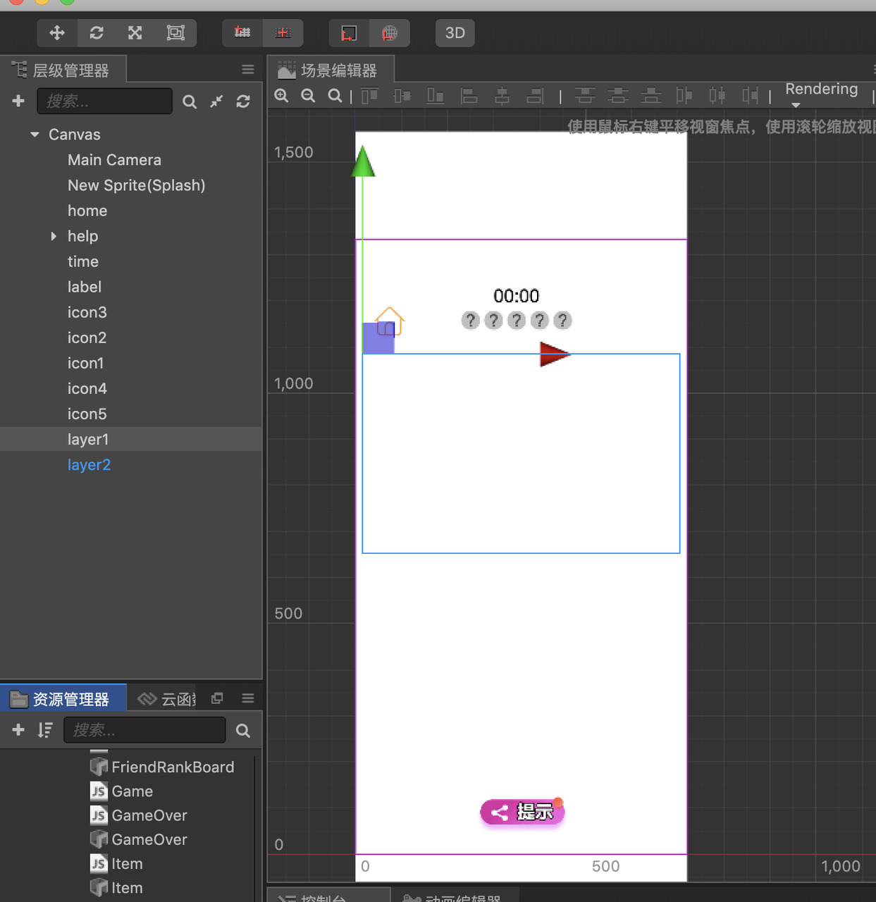
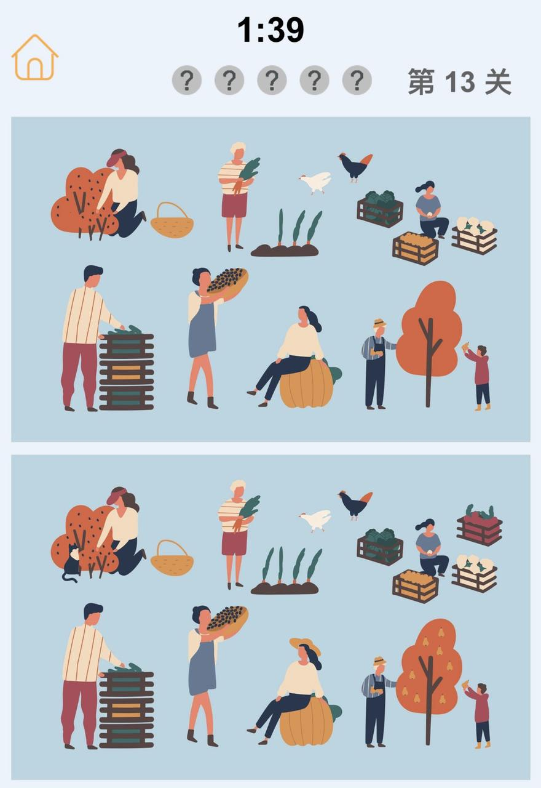
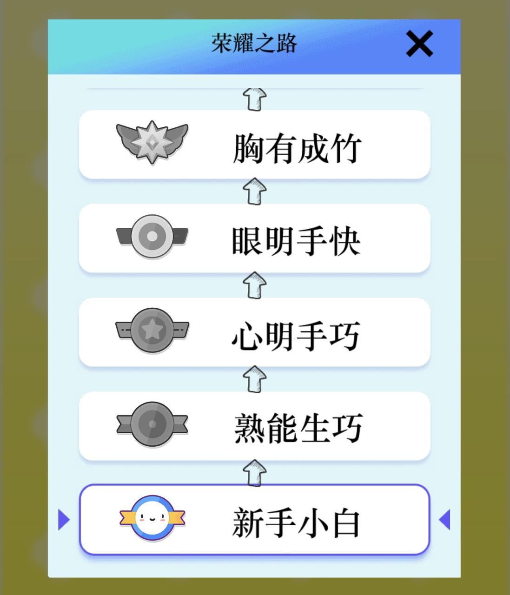
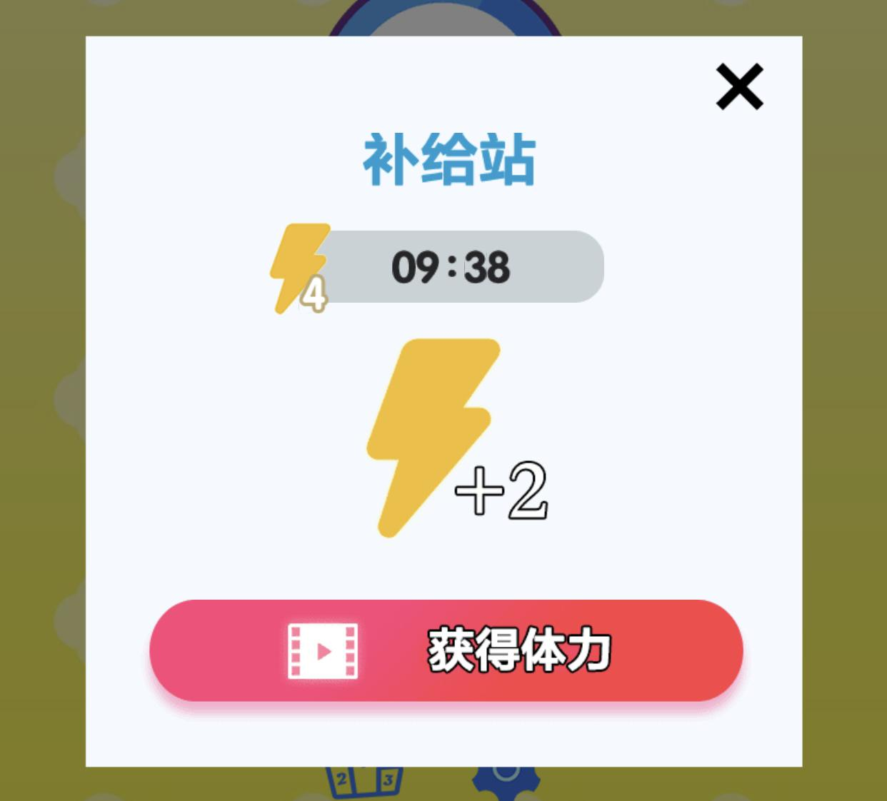

找茬类游戏是非常经典的一种玩法，找出两张图片所有不同的地方就可以顺利过关。一般来会在游戏中做计时器功能，限定在规定时间内找出所有不同点。也会设计道具功能，让玩家获得提示。单一玩法玩家可能很快就会厌倦，因此又有许多游戏会叠加其他子系统。本文来讨论下这种游戏的实战细节。技术难度一颗星，适合新手开发上手，游戏主要比较靠素材，图片找茬就是要依赖大量图。

## 核心模块

核心模块功能就是渲染图片，点击图片，判断游戏是成功还是失败。场景布局比较简单如下：

1、两个layer节点用来绘制背景图片

2、 一个提示按钮

3、 一个倒计时

4、 一个是当前找到的个数提示

5、 一个返回首页的按钮



### 渲染

每个关卡都有一个描述文件，比如

```json
{
    "skins": {
        "slots": [
            {
                "name": "layer",
                "layer": "standart",
                "x": 800,
                "y": -500,
                "width": 1602,
                "height": 1002
            },
            {
                "name": "carpet",
                "x": 587,
                "y": -937,
                "width": 408,
                "height": 128
            },
            {
                "name": "pillow_1",
                "x": 450.5,
                "y": -577.5,
                "width": 113,
                "height": 121
            },
            {
                "name": "bottle",
                "x": 733,
                "y": -217,
                "width": 100,
                "height": 120
            },
            {
                "name": "curtain",
                "x": 1158,
                "y": -159.5,
                "width": 258,
                "height": 191
            },
            {
                "name": "pillow_2",
                "x": 1324.5,
                "y": -624,
                "width": 79,
                "height": 74
            }
        ]
    }
}
```

上面的描述包括了六张图片，位置信息和尺寸，以及文件名。找茬游戏中两张图是非常近似的，实际只需要一张背景图和几张小图片，就可以完成一个关卡的渲染。如下图所示：




拿到json数据后，开始请求资源，根据文件名加上URL前缀，就可以下载到关卡图片，再根据位置和尺寸数据渲染出来。需要注意的是，上下图层都需要渲染所有图片，只不过，有一方的节点除了背景是正常显示，其他的节点透明度要为0，这样是为了方便给两张图添加点击事件。

```javascript
cc.loader.loadResArray(arr, (err, assets) => {
        this.renderLevelAssets(assets);
    }
);

// 渲染逻辑
var node = new cc.Node("New Sprite");
node.x = slots[index].x;
node.y = slots[index].y;
​
var img = new cc.Node("New Sprite");
var sprite = img.addComponent(cc.Sprite);
sprite.spriteFrame = new cc.SpriteFrame(assets[index]);
node.addChild(img)
​
let scaleX = slots[index].width < 150 ? 1.6 : 1; 
let scaleY = slots[index].height < 150 ? 1.6 : 1; 
​
node.width = slots[index].width * scaleX;
node.height = slots[index].height * scaleY;
img.width = slots[index].width;
img.height = slots[index].height;
​
this.layer1.addChild(node);
```

关卡数据和图片都是放到远程服务器或者CDN，小游戏包体积有限，只能放一两个关卡的数据。为了用户体验更好一点，减少等待时间，可以提前预加载下一关的数据。


### 点击事件

在上下背景图加上点击事件，如果点击到非答案区域要减扣时间。如果没有这逻辑，那游戏就没啥意义，随便点反正都能点到。另外5个小图片的点击事件，如果被点击到则提示成功找到，添加一个动画效果。全部找齐，则跳转到成功界面，时间结束没有找齐，则跳转失败界面。在游戏过程中可以使用提示，或者延迟时间的功能，引导用户看视频广告或者分享获得。

```javascript
this.layer1.on('touchstart', (e) => {
    this.errorAreaClickHandler(e, this.layer1);
});

node.on('touchstart', (e) => {
    this.puzzleClickHandler(e, 1, index);
    e.stopPropagation();                 
});
```

### 倒计时

设置一个倒计时器，如果时间到了结束游戏，这个是关卡失败的唯一条件。重要的是关卡时长，找到一个合适的数值，能够让一部分人使用提示。在剩余时间比较少时，设置一些特效，引导用户使用提供功能。

## 周边系统

以上是核心玩法系统，当然还可以设计一些周边系统，比如在我这个游戏中还设计了体力和段位系统。

### 游戏目标

为了让用户有一定的目标感，设计了段位系统，达到一定的关卡数后对于一定的段位，只需要将玩家的当前关卡数做一个映射就行，渲染用的是列表组件。同时结合小游戏的好友排行榜，让玩家之间进行一些攀比。



### 体力

体力模块更多的是为商业化、留存服务，每天限定体力，而且有恢复时间。为的是第二天让用户再来，不想一次性就把游戏玩够流失了。为的是引导用户观看视频广告，进行商业化变现。




除了这些，可以添加更多的子玩法，目标还是让用户的停留时长尽可能的长一些，留存数据好一点。如果要问我现在还能做找茬这类游戏吗？从技术沉淀上来看，是有必要的。如果你去看下抖音的小游戏排行榜，多款脑洞游戏都名列榜单头部。核心的逻辑都是类似的，这类游戏拼的不是技术，而是创意、脑洞、素材。但如果不沉淀一些技术能力，那么就无法快速抓住市场机会。


欢迎关注我的公众号，获取更多游戏开发知识和游戏源码，手把手教你做游戏。         


