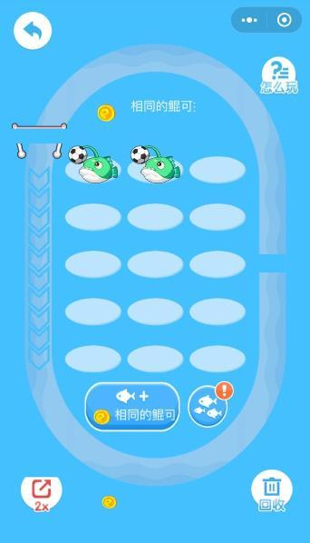
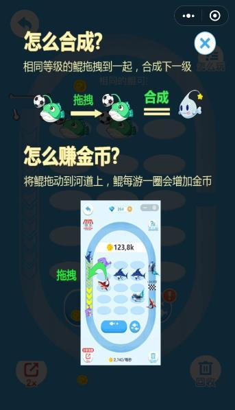
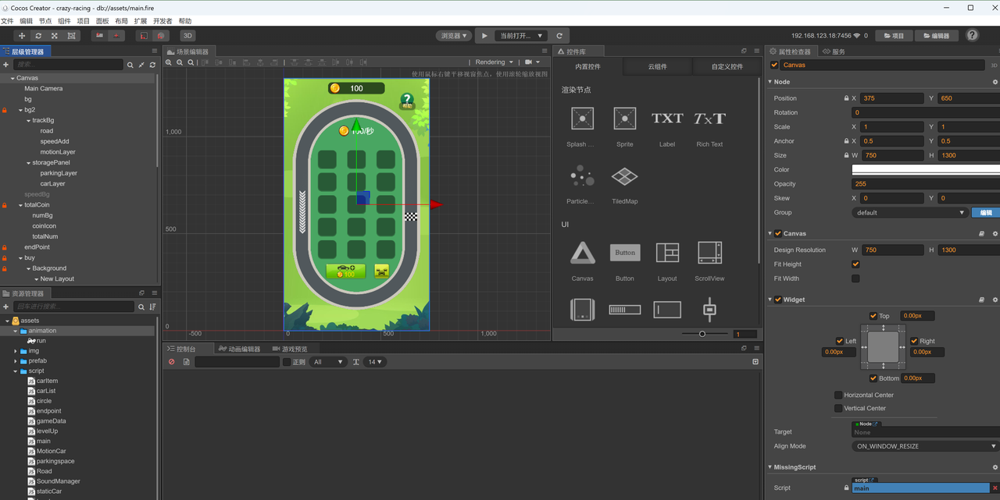

小游戏刚上线不久的时候，曾经一种游戏品类很火，各种换皮的游戏都出来了。第一款我记得应该是巨鲲来了，然后还有类似的游戏，比如汽车大亨等等。今天主要来讲解下这种游戏的实现思路，以及具体的实战演练。





游戏本身是不复杂，要实现这种游戏先来分析下要实现哪些模块，只要实现过类似的合成游戏，差不多玩法的合成游戏，基本是同一种套路。

## 1，拆解游戏模块

将复杂系统拆解成简单的独立模块再组合，复杂问题简单化，这是一种工程思维，任何系统都可以采用这种方式。

### 模块分解

1、赛道：曲线运动，运动速度，碰撞检测

2、合并升级：可拖拽，升级逻辑，回收逻辑

3、金钱系统：花钱买车，赚取金币，赚钱买更多车

4、车库：各种车型，可展览，是否可购买

.png>)

### 逻辑要点

* 合成功能，即相同类型的元素可以合并一起，得到一个新的模块，可以给每个元素一个**level编码**，依次递增。逻辑也很简单，相等的合并让其中一个level往上加1，另外一个元素销毁，这样就是二合一。

* 合并由于是要**拖拽**发生，所以每个独立的元素可以被拖拽，利用touch事件，改变元素位置即可实现拖拽。

* **碰撞**在一起才能发生合并，这是合并的先决条件，因此在touchend的时候判断当前拖拽元素是否碰了其他元素。

* 然后就是元素可以有多个坑位可以选择，**任意挪动**。

* 元素可以被拖拽到跑道上**运动**，赚取金币，只要与跑道上的某个点发生了碰撞即可获得，而且不同level的元素运动速度是不相同的，赚取金币的效率也是有差别。同时元素也可以被回收到跑道上来。

* 购买元素是需要花钱，钱通过元素放置在跑道上获取

* 通过分享或者看广告可以加速赚钱效率

* 不想要的元素可以放入垃圾桶彻底回收

以上就是游戏的主体逻辑，短短几句话可以概括出来，这就是做游戏应该有的第一步思考。当然我们这是借鉴别人的游戏玩法，自己要设计一款游戏的思路其实也是一样。最起码要有对游戏主题的构思，然后再针对每个点详细展开思考，把每个功能点想的更细致。对于新手来说，当然可以借鉴别人的玩法，然后再进行改进微创新，这样不用花费更多的时间在策划上，聚焦功能实现。

游戏的虽然玩法看起来很简单，但是要用代码实现，也没有那么容易，细节点非常多，需要花精力一步一步构建出来。下面就结合实战代码介绍下编码过程中要注意的事情。

## 2，游戏实战

沿着路径运动这一块不展开讲了，具体可以看之前发的文章，xxxx。然后核心的逻辑在于购买车辆和合成车辆。这实现过程很多逻辑可以借助chatGPT来帮助，尤其是工具算法函数，借助AI做游戏是事半功倍。比如要拖拽车子移动，就可以快速获得代码，比挨着手敲来得快。


车子分为形态：一个是运动中，一个是静态的。创建两种预制体，分别是实例对象。然后加上对应的class脚本，在静态的车子class里完成，合并，拖拽，合并升级的逻辑。

#### 静态车

通过分析，可以设计以下接口，来实现静态车子的逻辑。

```javascript
cc.Class({
    extends: cc.Component,

    properties: {
        // 在编辑器中将关联需要操作的精灵
    },
    setCarLevel(level){
        
    },
    setPositionIndex(value) {
        this.positionIndex = value
    },
    onLoad() {
        // 存储初始位置，用于拖动结束时还原位置
        this.originalPosition = this.node.position.clone();

        // 添加触摸事件监听器
        this.node.on(cc.Node.EventType.TOUCH_START, this.onTouchStart, this);
        this.node.on(cc.Node.EventType.TOUCH_MOVE, this.onTouchMove, this);
        this.node.on(cc.Node.EventType.TOUCH_END, this.onTouchEnd, this);
        this.node.on(cc.Node.EventType.TOUCH_CANCEL, this.onTouchCancel, this);
        this.isRuning = false;
    },

    onTouchStart(event) {
        // 回收正在跑的车子
        if(this.isRuning) {
            // 
            return;
        }
        // 记录触摸开始的位置（全局坐标）
    },

    onTouchMove(event) {
        if(this.isRuning) return;
        // 移动精灵
    },
    // 检测两辆车是否能够合并
    checkCarCollison() {
        // 检测与其他精灵是否发生碰撞
        // 如果相交且等级相同，且不是最高等级的车，则升级
        // 否则回到原处
    },
    twoCarsMerge(moveCar, targetCar) {
        // 合并车子 解锁新车子
        // 计算目标点的位置
    },
    levelUpAnimation(spriteFrame) {
       // 升级动画
    },
    checkCarCanMoveNewPosition() {
        // 检测与其他空停车位是否发生碰撞
    },
    onTouchEnd(event) {
        if(this.isRuning) return;
        if(this.isOnDropPlace()){
            return;
        }
        if (this.checkCarCollison()) {
            return;
        }
        this.checkCarCanMoveNewPosition();
    },
    
    isOnDropPlace() {
        // 是否放置在发车点
        // 发车，实例化动态的小汽车，开始在跑到上跑
    },
    
    calculateIntersectionArea(rect1, rect2) {
       // 计算两个碰撞框的交集区域面积
    },

    // 计算碰撞框区域面积
    calculateArea(rect) {
        return rect.width * rect.height;
    },
    onTouchCancel(event) {
        if(this.isRuning) return;
        // 触摸取消，还原精灵位置到拖动之前的位置
        this.node.setPosition(this.originalPosition);
        this.node.setScale(0.25);
        this.removeCloneCar();
    },
    createCloneCar() {
        // 拖拽时克隆一份放原处
    },
    removeCloneCar() {
        // 回到原处时候删除克隆车
    },
    onDestroy() {
        // 移除触摸事件监听器
        this.node.off(cc.Node.EventType.TOUCH_START, this.onTouchStart, this);
        this.node.off(cc.Node.EventType.TOUCH_MOVE, this.onTouchMove, this);
        this.node.off(cc.Node.EventType.TOUCH_END, this.onTouchEnd, this);
        this.node.off(cc.Node.EventType.TOUCH_CANCEL, this.onTouchCancel, this);
    }
});
```

#### 运动车

运动车的逻辑比较简单，只要负责沿着路径运动就可以沿着指定路径运动上一篇文章讲过了就不再复述。另一个状态就是是否被回收，回收了就销毁。

```javascript

cc.Class({
    extends: cc.Component,
    properties: {
        // 初始状态
        speed: 200, // 速度 200
        isRecycle: false
    },
    onLoad() {
        this.run();
    },
    setCarInfo(value){
        this.carInfo = value
        this.setSpeed(value.speed)
    },
    setSpeed(speed){
        this.speed = speed;
    },
    recycle(){

    },
    run(){

    },

    // 计算路径的总长度
    calculateTotalLength() {
       
    },

});

```

#### 工程



#### 体验专区


欢迎关注我的公众号，获取更多游戏开发知识和游戏源码，手把手教你做游戏。         

