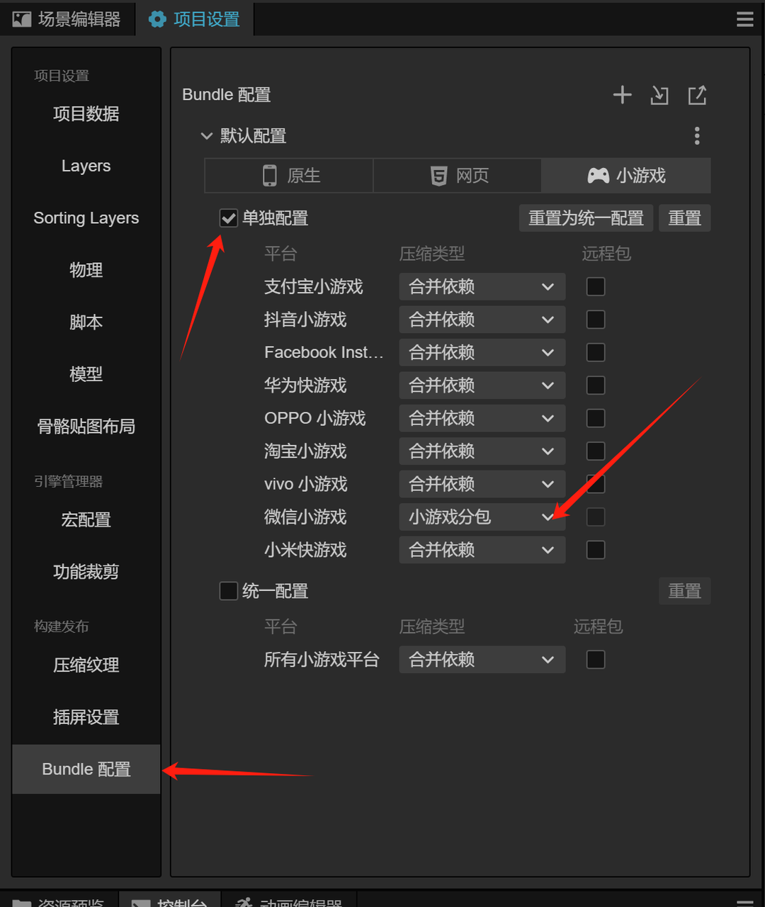

基于之前的花朵叠叠叠游戏做了两个优化跟大家分享一下一些思路。一个游戏体验不好技术上大概分为两种情况，

* 加载很慢，玩家用户等不起。这个主要是游戏本身大小和动态加载的资源慢。

* 玩的过程卡顿，玩家受不了。如果卡顿，一般会出现两种情况：一个是渲染跟不上，节点数量太多，绘制不过来，因为绘制的内容得要由CPU发送命令给GPU，内存也会被占用。第二个是计算性能跟不上，可能存在大量计算，需要做优化。手段有缓存、减小计算量等。总之大概的方向是这些，借助一些调试工具也可以很快定位出来。

之前开发的花朵叠叠叠游戏存两个很明显的问题，第一个是花店列表第一次渲染的时候特变卡，第二个是游戏加载时间比较慢，这些详细讲讲这两个问题，怎么优化。

## 高性能列表

花店列表其实就是一个列表优化的问题，面试的时候我很喜欢问这个问题。假设列表的数量是无限多的情况，时机渲染的时候肯定不能全部遍历挨个渲染出来，这样节点爆炸，游戏会直接卡崩掉。正确的做法是只渲染可视区域内的节点，其他节点按需渲染。


已知渲染窗口的宽高和每个节点的宽高，以及每一行需要展示的数量，那么可以算出渲染窗口的总数量，再预留一些缓存区域，以免滑动的时候露出空白的区域。在touch事件中，记录滑动的距离，根据距离计算出当前渲染数据的索引大小。这就是虚拟列表的原理。当然具体的实现会比较复杂，涉及到边界条件很多。刚好开源社区也找到一个比较好的开源库(https://github.com/gh-kL/cocoscreator-list)，本游戏也顺利接入，接入过程文档也清晰，也提供了说明文档。我这里也讲下整体的接入过程。

我使用的是Cocos 3.X的版本，用到List.ts和ListItem.ts两个代码文件，将这两个文件放入工程中。


然后在场景编辑器中拖放一个scrollView组件，scrollView节点绑定List代码，花束的Item预制体绑定ListItem代码。组件绑定就完成了，在main的逻辑中设置List组件的总数量，然后定义一个渲染函数，在熟悉面板中绑定节点的渲染函数即可。如果子节点是节点，渲染模版就选Node节点，否则就选择预制体。


```javascript
initData(){
        systemData.bouquetItemConfig.shift();
        // 总数
        this.itemList.numItems = systemData.bouquetItemConfig.length;
        
        let scrollIndex = 0
        for(let key in UserData.bouquet_unlockID){
            if(!UserData.bouquet_unlockID[key]){
                scrollIndex = +key
                break;
            }
        }
        // 滚动到指定位置
        this.scheduleOnce(() => {
            this.itemList.scrollTo(scrollIndex - 1);
        }, 0.1)
    }
    // 渲染函数
    itemRender(item: Node, idx: number){
        let it = systemData.bouquetItemConfig[idx];
        item.getComponent(ShopItem).init(it.name, it.id, it.level)
        item.getComponent(ShopItem).unlock = UserData.bouquet_unlockID[it.id]
    }
```

设置这些后，需要给content添加一个Layout组件，决定子节点需要怎么布局，单列或者单行、多行等等，这个根据你的需要决定。


设置以上信息后，就可以完成顺利渲染出来。调试一看结果列表是从中间开始渲染，这里需要调整下锚点，注意三级节点都要调整为一样的锚点，最后再调整Position放置到合适位置。看你的列表是从左还是右渲染，锚点不一定是（0， 1），调整完成之后就可以完美的展示出来了。


看下优化前后的对比，第一个打开明显快了很多，而且Drawcall数量也显著下降，FPS也会比较稳，不会剧烈波动。


同理，虚拟列表这个原则可以适用到其他任何多节点的场景。比如碰撞检测，就可以排除掉屏幕外的节点参与计算，也可以提高游戏性能。

讲完第一个问题，接下来分享下载耗时的问题。

## 小游戏打开速度优化

游戏资源很大，不优化都不能上传。当然也有方法了，分包，裁剪压缩资源，这需要多管齐下，本期讲讲分包。


### 如何分包

不得不说Cocos Creator功能是真强，简化了微信小游戏的开发。但该吐槽的还是要吐槽下，文档真的乱七八糟。我要正确的完成分包，着实花了不少时间，文档写的不够小白，指引不够清晰。

首先，要明白，微信小游戏分包只能是本地包。为什么要分包，可能是游戏内容过多，超过首包4M的限制。第二可能是按需加载，尽可能快的呈现游戏画面，避免用户流失。所以一般比较好的分包是

* 启动场景

* 游戏首页场景

* 主玩法场景

* 结果和其他场景

如果游戏比较简单，也可以简单到1-2场景。分包是需要自己手动下载的，不会自动下载，除非main场景是在分包中。

以我的游戏为例子，需求是要把flowers放到分包按需加载。看看官方的bundle怎么用，我以为这样设置就行了，万万没想到，编译结果不行。


那我就去小游戏的构建模式研究下，主包构建模式也可以选择小游戏分包。如果选择这个会不会有用呢，结果main bundle也被拆到分包里面去。但是这个结果并不是我想要的，我是想flowers打包到分包里面去啊。结果如下：


怎么拆到分包呢，需要去项目设置里面，单独设置构建方式为小游戏分包。个人感觉这里有点割裂。设置为小游戏分包后，就可以正确的构建到分包里面，在编译结果中自动加上了subPackage的描述字段。




### 怎么使用分包的资源

引擎也提供了简易的方法，请参考以下代码：

```javascript
 assetManager.loadBundle('flowers', null, (err, bundle)=>{
    bundle.load((targetFlowerID - 1) + '/spriteFrame', SpriteFrame, (err, spriteFrame) => {
        if (err) {
            console.error(err)
            return
        }
        targetFlower.getComponent(Sprite).spriteFrame = spriteFrame
    })
});
```

优化之后可以加快游戏的打开的速度，效果还是不错的，推荐大家使用。

性能上有什么问题也欢迎咨询\~

