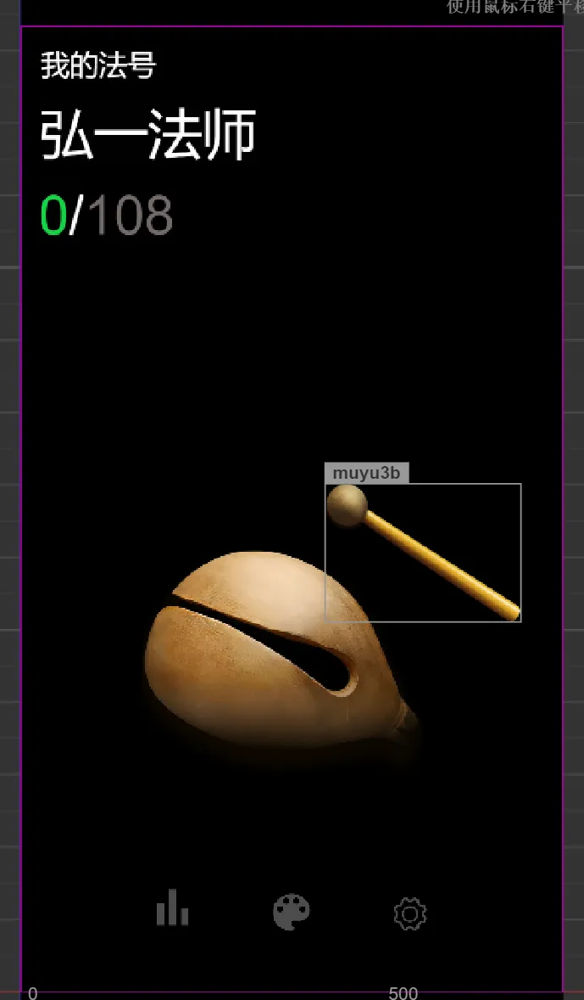
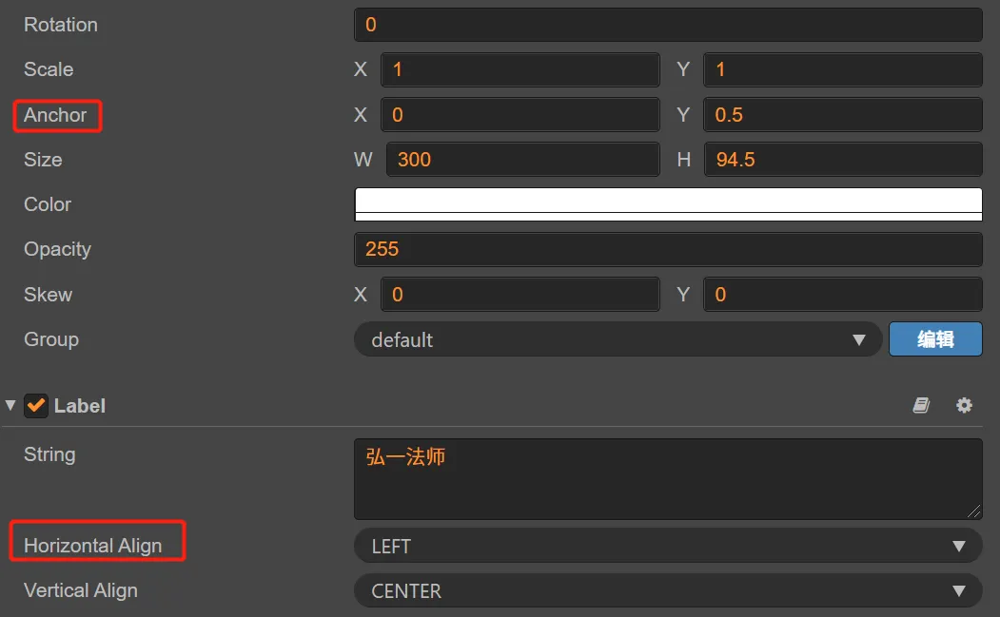
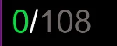
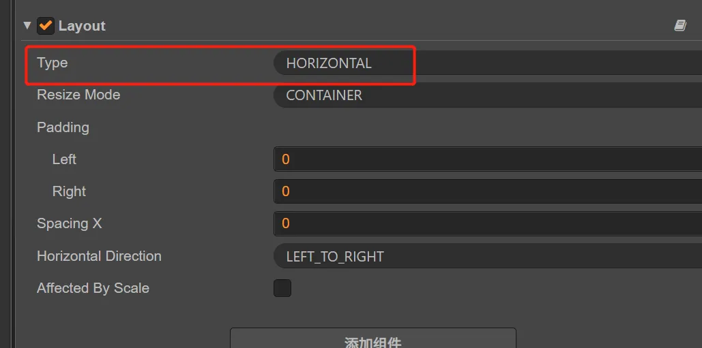
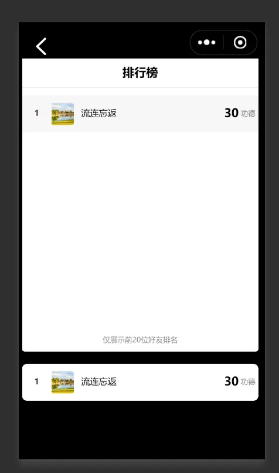

因为电子木鱼火了一阵子了，我也凑个热闹，最近这几天都在开发电子木鱼小游戏。今天才提审核，不知道能不能过得了，这玩意儿真的比一个demo还简单。本身可能也算不上游戏，玩法贼简单，敲击木鱼，累计功德数量。纯粹是无聊到不知道要做什么的人才会去玩啊。

引擎选的是Cocos Creator，毕竟对它最熟悉了。花时间较长的地方在UI上，没有美工，只能自己上，好在没有什么素材需要画。在布局上也学到了一些细节，比如文字的左对齐。你光在属性栏选择left是不够的，你还必须把锚点anchor设置一下，左边开始就是0，否则改变文字的时候不会从左开始。

另外一个是，多个文字排列在一行，在改变左侧文字的情况下，如何不用代码实现右侧的label被挤出。

0和180是两个label，都是动态更新的数字，当0变为1000时，如果不排挤其他的，肯定是叠加在上了，这个时候有两张方式，一个是代码算，一个是Layout布局组件算。从效率上讲肯定用Layout，选择横向自动布局。

我加了一个好友排行榜，来点社交攀比。后续看情况要不要加上群排行，以及世界排行榜，还得花点时间去开发。排行榜用的是官网推荐的组件，与Cocos搭配着一起用，有点小坑，花了一些时间调整。

然后给游戏加了点目标，从乞丐开始，功德数可以升级角色。添加了一个设置页面，可以选择音效，改变悬浮文字。整体功能算很简单了，后续再考虑要不要完善。

欢迎关注我的公众号，获取更多游戏开发知识和游戏源码，手把手教你做游戏。         

