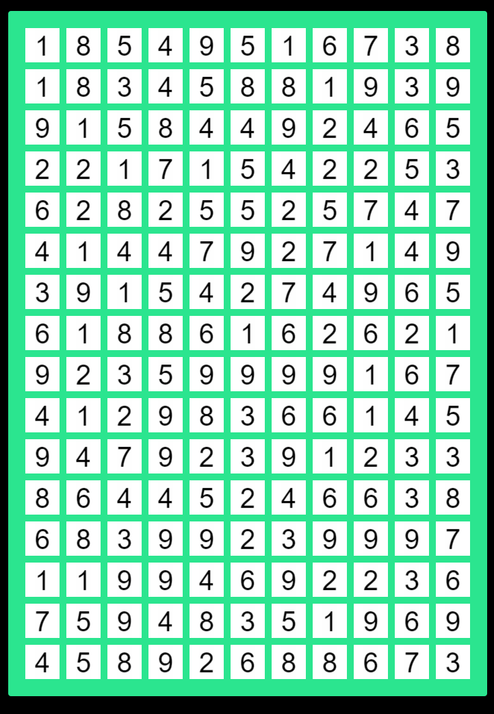
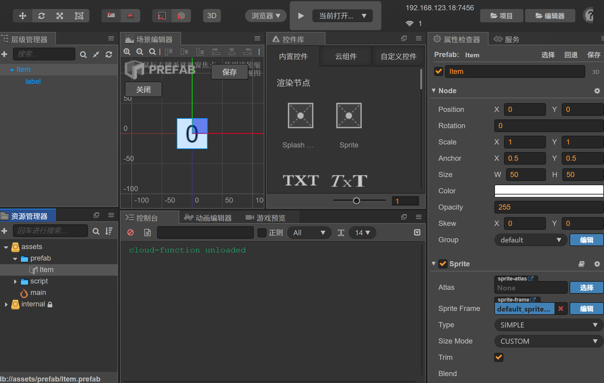
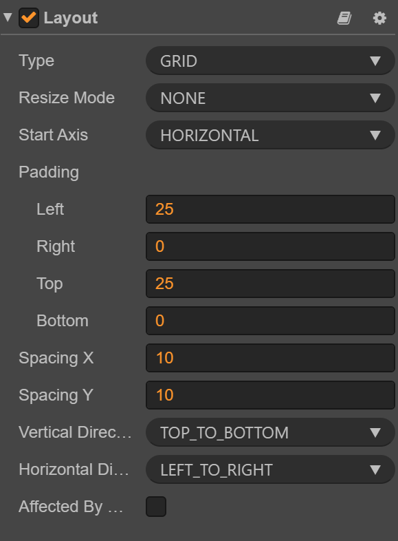
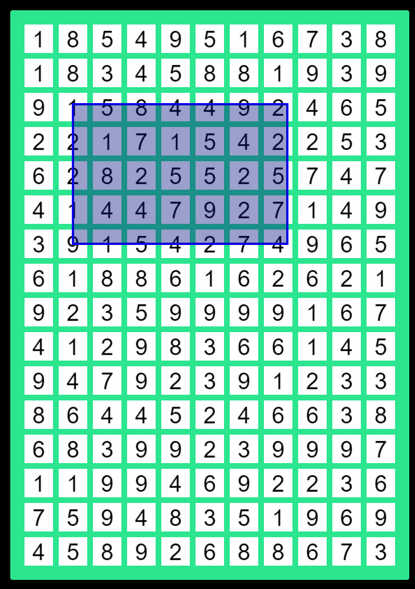

这游戏火了有一阵子了，今天来教大家怎么实现这样一种玩法，其实还真的没有很复杂，抛开其他不讲，就只说核心玩法，估计也就100来行代码就可以实现。



拆解下玩法就三大核心要点：1、方块生成逻辑；2、手指画框；3、方块消除。

## 1、方块生成逻辑

既然要生成方块，那先得有方块。拖拽一个Splash Sprite作为方块block，然后添加一个label节点作为数字的节点。这就是最简单的一个方块了，把这个方块生成一个预制体。然后添加一点逻辑，新建一个script脚本挂在上面。方块的主要逻辑就是随机一个数字作为方块的值

```javascript
 onLoad () {
    this.text = 1 + Math.floor(Math.random() * 9) + ''
    this.label.string = this.text
}
```



有了方块然后要生成一堆方块，这个时候就要借助Layout组件了，天然适合这种布局。新建一个Layout容器，设置宽700高度1000，这个你可以随意发挥。然后类型是grid布局，然后x和y方向的间隔设置为10左右。剩下就是实例化方块，添加到容器，特别要注意注释的地方，一定要关闭自动布局，否则在消除方块的时候布局会跳动。




```javascript
initBlocks() {
    this.itemLayout.enabled = true;
    // 节点数量自定义
    for (let index = 0; index < 176; index++) {
        let block = cc.instantiate(this.block)
        block.parent = this.itemLayout.node
    }
    this.itemLayout.updateLayout()
    this.itemLayout.enabled = false; // 关闭布局，否则会闪烁
}
```

在onload的时候调用即可得到下面的布局了，生成了布局后那就要实现下一个逻辑。

## 2、手绘画框

核心思想是利用graphics组件，添加一个graphics节点，然后宽高保持跟棋牌一样的大小。监听touch事件，然后就是获取手指的坐标，graphics.rect是绘制矩形的方法。移动的时候绘制，离开的时候清除矩形。具体代码可以参考如下

```javascript
onTouchStart(event) {
        this.isDrawing = true;
        this.startPoint = this.rectNode.convertToNodeSpaceAR(event.getLocation());
        this.endPoint = this.startPoint;
    }

    onTouchMove(event) {
        if (this.isDrawing) {
            this.endPoint = this.rectNode.convertToNodeSpaceAR(event.getLocation());
            this.drawRectangle();
        }
    }

    onTouchEnd(event) {
        if (this.isDrawing) {
            this.endPoint = this.rectNode.convertToNodeSpaceAR(event.getLocation());
            this.checkSum();
            this.isDrawing = false;
            this.startPoint = cc.v2(0, 0);
            this.endPoint = cc.v2(0, 0);
            this.rectNode.getComponent(cc.Graphics).clear();
        }
    }

    drawRectangle() {
        let graphics = this.rectNode.getComponent(cc.Graphics);
        graphics.clear();
        graphics.rect(this.startPoint.x, this.startPoint.y, this.endPoint.x - this.startPoint.x, this.endPoint.y - this.startPoint.y);
        graphics.stroke();
        graphics.fill();
    }
```

## 3、方块消除

有了手绘的矩形，那么就只要判断这个矩形与方块是否相交。但是graphics绘制的矩形是没有方法直接转换到世界坐标系下的。这里为啥要世界坐标系，因为都是来自不同的子节点，转换到世界坐标系是最好判断的，也有现成的方法。因此这里要转换一下思路，反正graphics的矩形坐标是知道的，那么可以创建一个临时的Node节点，这个节点的坐标和尺寸保持跟graphics一样就行，这样就很方便的获得了手绘矩形的世界坐标

```javascript
 // graphics的rect无法转为世界坐标，借助一个中间节点来完成这个事情
let graphicsNode = new cc.Node()
graphicsNode.parent = this.rectNode;

let width = Math.abs(this.endPoint.x - this.startPoint.x);
let height = Math.abs(this.endPoint.y - this.startPoint.y);
let x = Math.min(this.startPoint.x, this.endPoint.x);
let y = Math.min(this.startPoint.y, this.endPoint.y);

graphicsNode.width = width;
graphicsNode.height = height;
graphicsNode.position = cc.v3(x + width / 2, y + height / 2, 0);

// 获取矩形框的位置和尺寸
let rectBoundingBox = graphicsNode.getBoundingBoxToWorld();
```

接下来就是遍历判断是否相交

```javascript
 // 遍历判断是否相交，理论还能优化下，距离很远的是直接跳过
this.itemLayout.node.children.forEach((element: cc.Node)=> {
    let childBox = element.getBoundingBoxToWorld();
    // 判断矩形框与精灵是否相交
    if(rectBoundingBox.intersects(childBox)){
        // console.log("矩形框与精灵相交！");
        res.push(element)
    } else {
        // console.log("矩形框与精灵不相交。", childBox);
    }
})
```

把相交的结果推进一个数组，最后就是遍历获取数组的值，然后判断相加的结果是否等于10，如果等于10，则从当前的棋盘删除掉。记得顺手把临时的节点也删除，不要临时节点会越来越多。以上就是玩法的核心逻辑，当然为了让游戏体验更好，可以加一些动效，比如删除节点的动画，碰撞的震动等等。



还有一个点就是游戏结束的逻辑，如果棋盘的方块没有了，那肯定是结束了，但是这个是最简单的case。还有一个场景要考虑，就是死局情形，用户手绘的矩形无法消除剩余的方块，因为都是随机的数字，所以肯定是存在这种问题。这个问题比较难解，因为要判断两数之和等于10，三数之和等于10，四数之和等于10。。。。。N数之和等于10，这个逻辑就非常麻烦了，所以我猜开局托儿所也是搞个倒计时，时间到了就结束，不管还有多少，大不了就是用户多等了一会儿游戏结束，最后的结果也不是失败了，而是获得相应的积分。


可以扫码体验一下，玩法大差不大。


欢迎关注我的公众号，获取更多游戏开发知识和游戏源码，手把手教你做游戏。         

