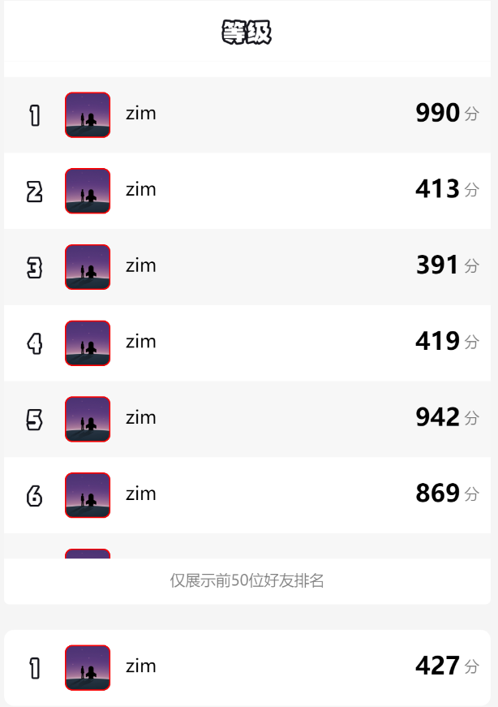
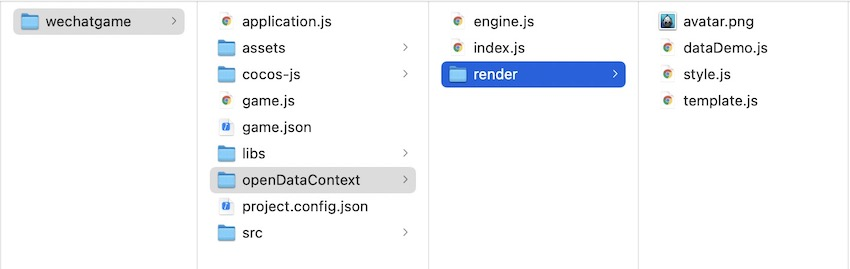
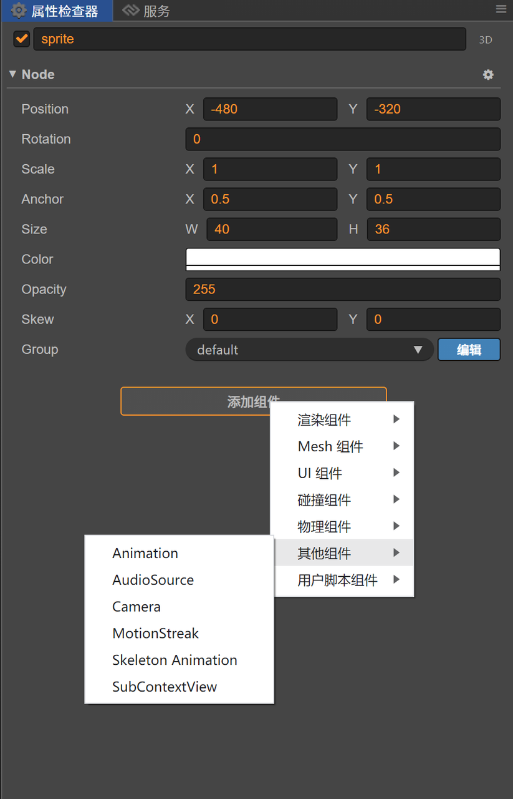
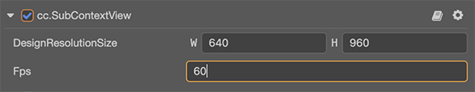

这个功能初学者理解起来会很费解，因为使用上没有这么方便，而微信的初衷是为了保护自己的用户关系链数据。那么背景就是开发者不能直接拿到好友关系链数据，只能在一个封闭的作用域里面获得这个数据，这个隔离的作用域不能发送网络请求，而且只能被动的接受外界的数据，不能数据出去。详细的资料看这里https://developers.weixin.qq.com/minigame/dev/guide/open-ability/opendata/basic.html

更多的背景这里不做过多介绍，那么讲一下在Cocos中如何快速的开发一个好友排行榜。

两种方式

1、纯JS代码接入，2、还有一种就是代码+IDE的方式接入。

首先我们要理解排行榜的逻辑它不是简单的一个绘制图片和文字，它还必须是一个列表，能滚，飞快的滚。那么这里不是100行代码能搞定的事情。我看过很多游戏，直接用Cocos引擎放在子域来做这个事情，那么包就变得很大了，这里性能上得不偿失。为了这么一个小小的功能，引入这么大个玩意儿。因此有更简单有没有那么多代码的事情吗？当时是有的，小游戏官方提供了一个绘制子域的逻辑，而且不仅仅是排行榜能力，统统都封装好了，开发者啥事都不用操心。

那么怎么接入呢，第一步，就是要初始化一个节点，来绘制子域的这个sharedCanvas，代码如下：

```javascript
var subContextNode = new cc.Node('开放数据域');
subContextNode.addComponent(cc.WXSubContextView);
subContextNode.width = 1334;
subContextNode.height = 1974;
```

这个代码理解起来很加单，new一个Node节点，然后添加一个WXSubContextView的组件到它上面，因为WXSubContextView组件能够做到以一定的帧率自动绘制sharedCanvas，所以开发者不用操心怎么会知道的问题。只要将这个节点添加到我们的场景中，就能看到效果，如果要关闭呢，将节点隐藏就行。

第二步呢，就是实现子域的绘制逻辑，这个逻辑可以参考下官网给的例子。

https://wechat-miniprogram.github.io/minigame-canvas-engine/playground.html

写过小程序你就很好理解这个东西，XML+CSS+JS就能绘制出一个排行榜了。





* **render/dataDemo.js**：模拟随机的排行榜数据，开发者可以在这里请求平台方的关系链数据，并传给 **doT 模版引擎** 生成相应的 XML 文本

* **render/style.js**：记录 CSS 样式文本信息，可参考 [样式文档](https://wechat-miniprogram.github.io/minigame-canvas-engine/api/style.html#%E5%B8%83%E5%B1%80)

* **render/template.js**：记录 XML 文本信息，默认使用 **doT 模版引擎** 生成 XML 文本。可参考 [标签文档](https://wechat-miniprogram.github.io/minigame-canvas-engine/api/tags.html#%E6%A0%87%E7%AD%BE%E5%88%97%E8%A1%A8)

* **render/avatar.png**：开放数据域模板默认使用的头像贴图，可删除，上线换成真实用户的头像。

* **index.js**：开放数据域工程入口文件，在该文件中通过将 XML 文本和 CSS 样式传递给 Canvas 引擎，即可渲染开放数据域

* **engine.js**：小游戏 Canvas 引擎源码，当然也可以直接使用官网的插件，就不用这个文件了。

1.在game.json配置插件引用:

```json
{"deviceOrientation": "portrait","openDataContext": "sub","plugins": {"Layout": {"version": "0.0.14","provider": "wx7a727ff7d940bb3f","contexts":[{"type":"openDataContext"}]}}}
```

2.在开放数据域内引用插件：

```javascript
const Layout = requirePlugin('Layout').default;
```

所以使用就非常简单，通过这两步操作就能绘制出一个好友排行榜。


那么第二种方式的差别就是不用自己手动去创建一个画布节点，通过cocos 的ide工具拖拽出来。






好了，来体验下成品，点击下方小游戏体验，有需要好友排行榜源码的私信。

欢迎关注我的公众号，获取更多游戏开发知识和游戏源码，手把手教你做游戏。         

