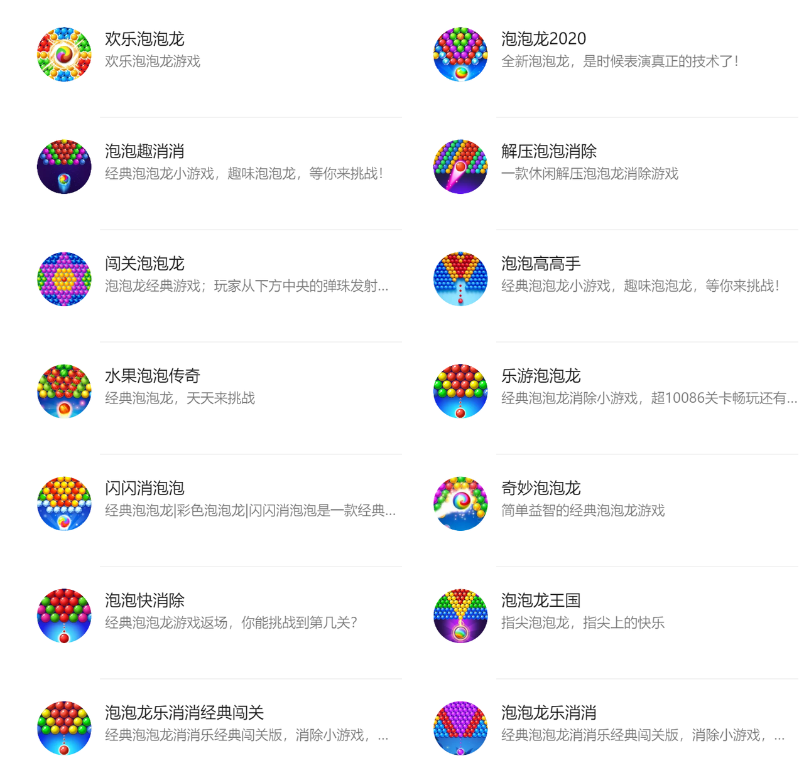

泡泡龙游戏是一款经典的消除类游戏，玩家通过发射不同颜色的泡泡，连接三个或更多相同颜色的泡泡即可消除。这次手把手教你实现一个泡泡龙游戏。我尽量讲得通俗易懂一点，涵盖从场景搭建、泡泡发射、碰撞检测、消除逻辑等关键环节。这次走了点弯路，其实可以不用物理引擎也可以做。老规矩，先看效果。


如果你还不太知道泡泡龙的逻辑，我建议就去微信上玩一下，大概有几十款，玩法都差不多，玩过一遍之后你也能知道到底怎么样的游戏是好游戏，好的游戏会有什么特点。




### 前置准备


1. **安装 Cocos Creator 3.8**

   * 下载并安装 Cocos Creator 3.8 版本。

   * 打开 Cocos Creator，创建一个空白的 2D 项目。


2. **素材准备**

   * 需要用到 8 种不同颜色的泡泡图片（例如 1.png、2.png、3.png。。。）。

   * 准备背景图片素材。

   * 准备一个虚线路径图片（例如 dots.png）用于显示泡泡发射路径。

   * 准备几个音效素材

这个游戏的核心玩法需要的素材不是很多，顶多10个素材就够了。


### 创建基础场景

在搭建场景之前，先梳理下模块和逻辑。

* 发射泡泡需要**发射器**

* 顶部有**泡泡地图**

* 发射器的泡泡和泡泡地图上的泡泡都是一样的**泡泡**

* 体验好一点的话，可以**提前预览**下一个泡泡

* 再体验好一点的话，可以**提前预览泡泡**的落地位置，或者设置为看广告后可以**提前预览**

* 三个以上相连的泡泡可以消除

* 体验好一点可以加一些动画效果，比如泡泡撞击的动画，消除的动画


逻辑点不多，那就搭建场景开干。

#### 设置场景节点


在场景中搭建基础节点：


1. **创建一个空节点**，命名为 `BubbleContainer`，用于存放所有泡泡。

2. **创建一个空节点**，命名为 `CurrentBubbleNode`，用于存放当前发射的泡泡。

3. **创建一个空节点**，命名为 `NextBubbleNode`，用于预览下一个发射的泡泡。

发射器中的dashedLine就是提示线，dashedBubble 显示落点


&#x20;

设置 `BubbleContainer` 的坐标位置为 (0, 677)设计尺寸的最高点，这样可以让泡泡在屏幕上方生成。


### 生成泡泡地图

泡泡排列是有规则的。可以理解为六边形网格中放置一个泡泡，泡泡之间紧密挨着。在实现上同样也可以用二维数组来存储信息，真是万能的二维数组：


偶数行（从0开始）贴着边缘，奇数行水平方向偏移泡泡半径，垂直方向是行号\*根号三\*泡泡半径。为了不超出屏幕，奇数行统一少渲染一个。那么就可以渲染出下面的地图：


### 创建发射器

放置在屏幕靠底部的中间位置。发射器的主要逻辑就是发射新的泡泡到泡泡地图上。手指在地图上移动开始瞄准方向，松开手指就是发射。以下是一些思路：

**手指移动**：在触摸 `touchmove` 事件中，根据手指的位置实时调整发射器的角度。

**路径计算**：通过模拟计算泡泡发射路径，包括反弹。

**虚线路径绘制**：将路径分段，通过虚线节点显示，并根据手指的移动动态更新虚线显示。

```javascript
this.node.on(Node.EventType.TOUCH_MOVE, this.aim, this);
this.node.on(Node.EventType.TOUCH_END, this.shootBubble, this)
```

**复杂的地方是计算泡泡的落点**。从发射起点出发，手指作为方向终点，可以计算出发射的方向。沿着发射方向每50个像素单位记录一个点，不断的添加新点，获得泡泡的运动路径。

这个过程，要处理的情况有：

* 碰到左右墙壁，要把方向反向

* 碰到泡泡，停止计算

* 碰到顶部，停止计算

```javascript
const stepDistance = 50;
let distanceCovered = 0;

while (distanceCovered < maxDistance) {
    const nextPoint = this.calculateNextPoint(currentPoint, dir, stepDistance);

    if (this.isCollisionWithWall(nextPoint, screenWidth)) {
        dir = this.handleWallCollision(nextPoint, screenWidth, dir);
    }

    if (this.isCollisionWithCeiling(nextPoint, screenHeight)) {
        this.handleCeilingCollision(nextPoint, points);
        break;
    }

    const collidedBubble = this.checkBubbleCollision(nextPoint, existingBubbles);
    if (collidedBubble) {
        this.handleBubbleCollision(collidedBubble, nextPoint);
        points.push(nextPoint.clone());
        break;
    }
    points.push(nextPoint.clone());
    currentPoint = nextPoint;
    distanceCovered += stepDistance;
}
```

以上是获取路径点的逻辑，有了路径点，那么让泡泡沿着路径匀速运动就行。

然后关键是计算落点，因为泡泡是规则排布，所以泡泡也必须落到这个对应的网格。

在计算路径的时候，可以提前获取到会发生碰撞的targetBubble，targetBubble有6个邻居bubble，但是得区分一下奇偶：

```javascript
export function getAdjacentPositions(row: number, col: number): Array<{ adjRow: number, adjCol: number }> {
    const adjacentOffsets = ((row + 1) % 2 === 0) ?
        // 偶数行的邻居
        [
            { adjRow: row - 1, adjCol: col },     // 上左
            { adjRow: row - 1, adjCol: col + 1 }, // 上右
            { adjRow: row, adjCol: col - 1 },     // 左
            { adjRow: row, adjCol: col + 1 },     // 右
            { adjRow: row + 1, adjCol: col },     // 下左
            { adjRow: row + 1, adjCol: col + 1 }, // 下右
        ]
        :
        // 奇数行的邻居
        [
            { adjRow: row - 1, adjCol: col - 1 }, // 上左
            { adjRow: row - 1, adjCol: col },     // 上右
            { adjRow: row, adjCol: col - 1 },     // 左
            { adjRow: row, adjCol: col + 1 },     // 右
            { adjRow: row + 1, adjCol: col - 1 }, // 下左
            { adjRow: row + 1, adjCol: col },     // 下右
        ];

    return adjacentOffsets;
}

```

满足条件的落点是：

* 当前有空位。

* 位置不能超出行列边缘。

* **距离路径最后一个点最近的位置**。

```javascript
// 计算泡泡碰撞后需要对齐到网格的最近位置
    getClosestGridPosition(targetBubble: Node, targetBubblePos: Vec3, nextPoint: Vec3): { row: number, col: number } {
        const targetPos = targetBubble.getComponent(Bubble).getRowCol();
        if (!targetPos) return { row: 0, col: 0 };

        const { row, col } = targetPos;
        const adjacentPositions = getAdjacentPositions(row, col);

        let nearestPos = null;
        let minDistance = Infinity;

        for (const { adjRow, adjCol } of adjacentPositions) {
            if (!this.isValidPosition(adjRow, adjCol)) continue;

            const adjPos = this.calculateAdjacentPosition(targetBubblePos, row, col, adjRow, adjCol);

            const distance = adjPos.subtract(nextPoint).length();
            if (distance < minDistance) {
                minDistance = distance;
                nearestPos = { adjRow, adjCol };
            }
        }

        return nearestPos ? { row: nearestPos.adjRow, col: nearestPos.adjCol } : { row: 0, col: 0 };
    }
```


### 创建泡泡预制体

因为发射器和地图里的泡泡都是一样的，因此需要搞个预制体

1. **新建一个预制体**，命名为 `Bubble`。

2. 在 `Bubble` 中添加图片组件，将泡泡图片（1-8.png）作为默认纹理。

3. 设置纹理、添加泡泡消除动画组件

4. 记录泡泡的行列位置


整体没有特别复杂的逻辑。

```javascript
// 根据泡泡类型加载相应的图片
loadBubbleSprite(bubbleType: number) {
    if (bubbleType >= 1 && bubbleType <= this.bubbleSpriteFrames.length) {
        this.sprite.spriteFrame = this.bubbleSpriteFrames[bubbleType - 1];
    } else {
        console.error('Invalid bubble type:', bubbleType);
    }
}
```

### 实现消除逻辑

最后就是要处理消除。匹配相同颜色的泡泡，从最近发射的泡泡开始遍历。找到6个相邻泡泡判断颜色，如果与目标类型一样，放入到临时数组中。当三个或更多相同颜色的泡泡连在一起时，触发消除：

```typescript
// 检查是否有三个或以上相连的同色泡泡
checkForMatches(startPosition) {
    const bubbleType = this.bubbleGrid[startPosition.row][startPosition.col].getComponent(Bubble).bubbleType;
    const visited = new Set<string>();
    const stack = [startPosition];
    const matches: Node[] = [];

    while (stack.length > 0) {
        const position = stack.pop();
        const key = `${position.row},${position.col}`;
        if (visited.has(key)) continue;
        visited.add(key);

        const bubble = this.bubbleGrid[position.row] && this.bubbleGrid[position.row][position.col];
        if (bubble && bubble.getComponent(Bubble).bubbleType === bubbleType) {
            matches.push(bubble);
            const neighbors = this.getNeighbors(position);

            for (const neighbor of neighbors) {
                stack.push(neighbor);
            }
        }
    }

    // 如果找到三个或以上的相连泡泡，则消除
    if (matches.length >= 3) {
        this.removeBubbles(matches);
    }else{
        this.soundPlayer.playSound("sound/stop");
    }
}
```

如果消除完后出现了孤立的泡泡，也消除掉，这个逻辑暂时没做，其实也是遍历处理。

### 总结


通过以上步骤，你已经可以完成了一个简单的泡泡龙游戏。涵盖了从泡泡生成、发射、碰撞检测、反弹、网格吸附和消除的所有关键步骤。你可以根据自己的需求扩展更多功能，比如关卡设计、音效、得分系统等。


### 延展功能

增加关卡：通过调整泡泡的排列、颜色数量等，设计更多有趣的关卡。


希望这篇教程能帮助你上手泡泡龙游戏的开发。

欢迎关注我的公众号，获取更多游戏开发知识和游戏源码，手把手教你做游戏。         

