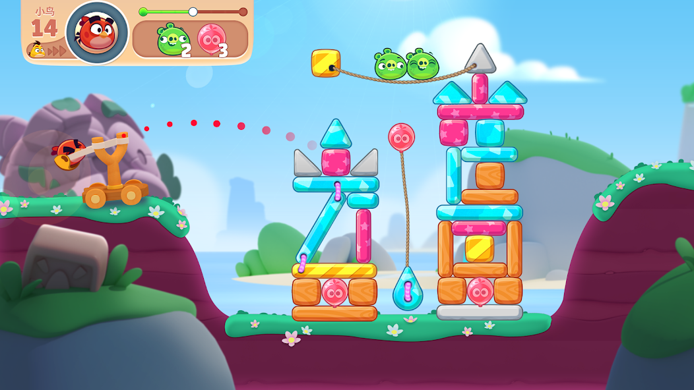
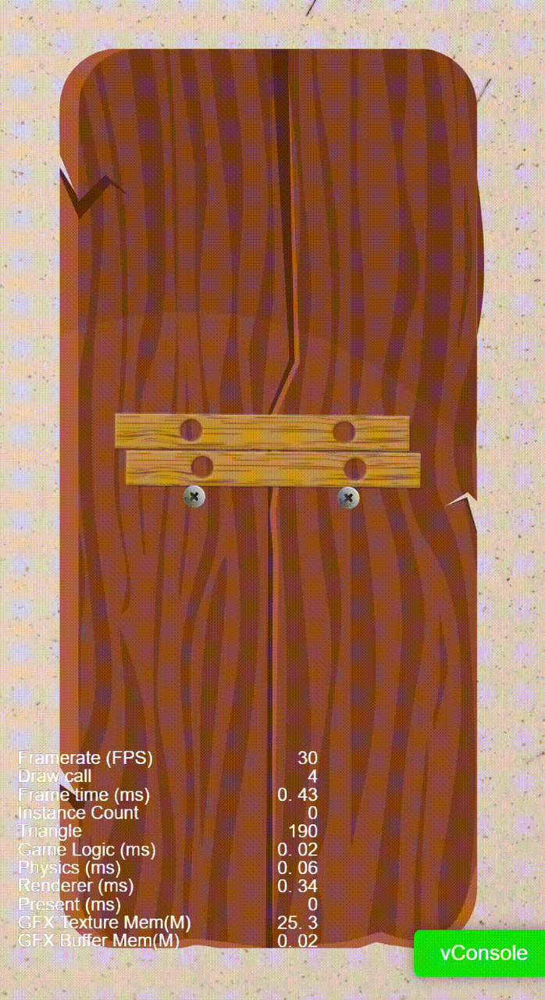
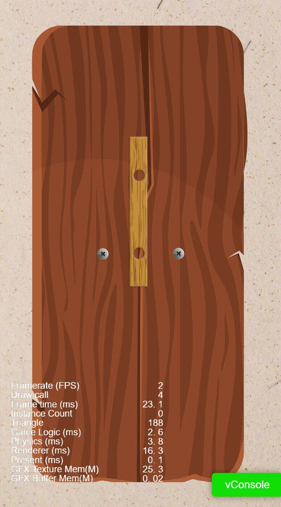
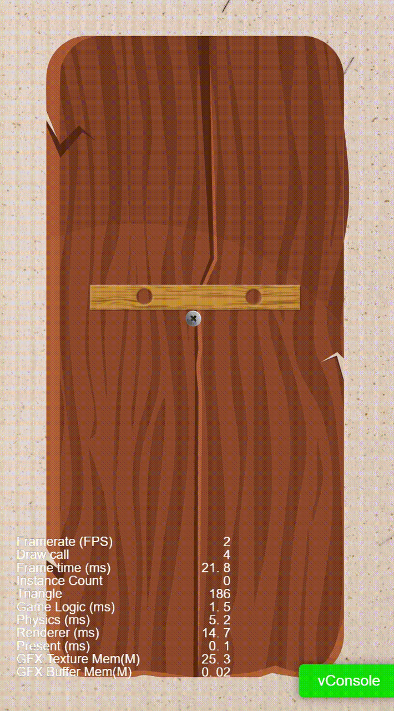
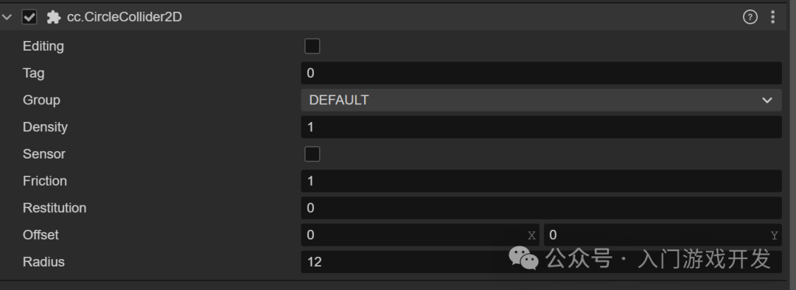
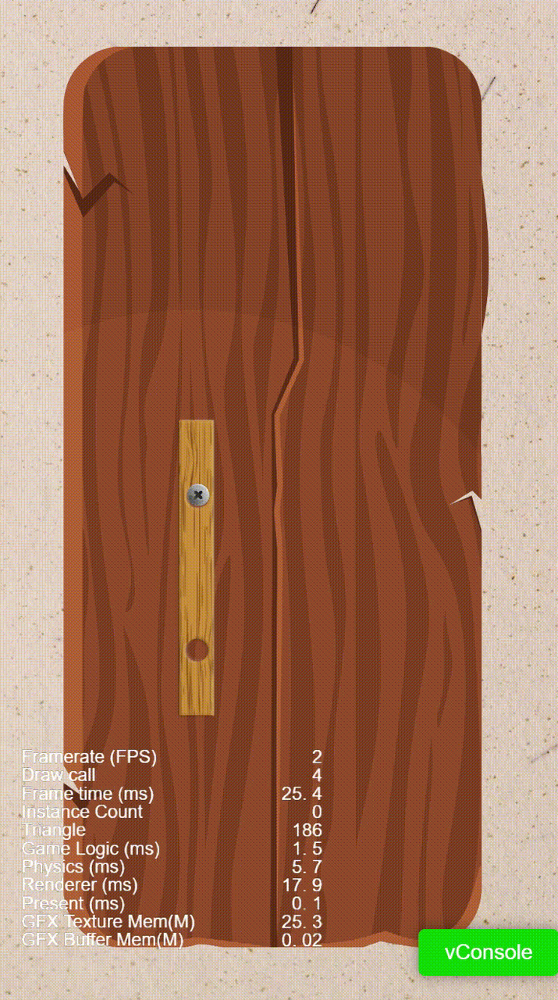

之前有同学反馈要我写写打螺丝游戏是怎么做的。现在有两种不同玩法的螺丝游戏，一个是关不住我吧系列，另外一个是更早期的打螺丝达人系列。差异点就是关不住我吧的钉子，只钉在一块板子上。而打螺丝达人的钉子是可以钉好几块板子。核心玩法都是物理拆钉子游戏。这个有两种实现方式，一个是利用关节特性，比如铰链关节，绳索关节。另外一个就是用普通刚体实现就行。现在终于有时间了，今天先介绍普通刚体实现的打螺丝游戏。

## 物理引擎

模拟真实世界是游戏最基本的能力，那么要模拟现实世界，离不开物理引擎。物理引擎能给游戏的角色赋予逼真的物理效果。比如模拟重力、摩擦系统、两个物理发生碰撞、弹跳等等。早期比较知名的游戏：愤怒的小鸟、割绳子、物理的弹球，都是非常经典的作品。前两年的划线救狗狗，最近比较火的打螺丝达人、关不住我吧等游戏，都是运用了物理效果。

### 刚体

物理游戏都离不开刚体，这个是物理引擎中的一个抽象概念。

#### 分类

刚体一般分为三种类型，`static`,`dynamic`,`kinematic`.

* **static**，表示静态刚体，犹如质量巨大无比的石头，具体为质量为`0`的，或者只有碰撞组件的物理元素。

* **dynamic**，表示动力学刚体，能够**受到力的作用**，具体为质量大于`0`并且`isKinematic`为`false`的。

* **kinematic**，表示运动学刚体，由用户来控制该刚体的运动，具体为质量大于`0`并且`isKinematic`为`true`的。

#### 使刚体运动

* 重力

* 施加力

* 施加扭转力，影响旋转

* 直接设置速度

#### 限制刚体的运动

* 休眠

* 阻尼`linearDamping`和`angularDamping`

* 固定旋转fixedRotation

* 因子`linearFactor`和`angularFactor`

总之，就是具备刚体特性后，就可以模拟物理的一些特性，包括受到重力影响，也可以具备物理加速度，还能够与其他刚体发生碰撞并反弹，不能与其他刚体叠加在一起。尽可能表现出跟现实世界物体一样的特性。就跟两块木板一样，他们会真实发生硬核的刚性碰撞，看一个图片来理解下。

最核心的一点就是钉子和板子怎么关联。其实也比较简单，让钉子勾住板子，不往下掉就行。

把钉子设置为静态刚体，不受重力影响。

把板子设置为动态刚体，受到重力影响。

A场景，板子和钉子分离开了，钉子没法钉住板子

B场景，钉子在板子下方，板子会从左右两侧翻下去

C场景，板子有个缺口，看似可以让板子固定，但有很大概率还是会从左右两侧翻下去

D场景，板子中间有个孔，孔里放个钉子，这样就掉不下去了。

# **刚体碰撞**

刚体是让精灵具备物理特性，那么让两个刚体直接发生碰撞，以及碰撞的轮廓是需要另外一个组件来描述。Collider2D，这个碰撞组件有3种类型，包括矩形/圆形/多边形。根据精灵的特点选择对应的类型，具体每个参数可以自动去调试看看。

关键问题来了，板子的刚体轮廓是一个异形的，在矩形中间挖一个孔，这个孔放入钉子，只要钉子和板子刚体是可以碰撞检测。那么不移除掉钉子，板子是永远不会掉落，所以就完美实现了要的效果。核心问题是动态算出板子这个异形的刚体轮廓。看下最终效果：

在引擎开发工具中，开始调试模式，可以看到刚体的真正轮廓。如下图

原理是用三角形近似的模拟带孔的刚体。本例中取4个点模拟中间的圆孔，得到一组描述这个圆的路径。然后获取板子素材外轮廓的路径点集，这个可以利用cocos自带的组件获取。借助Clipper这个库将两个路径相减，然后将结果利用三角化多边形算法获取最终的三角形集合，可以参考这个库的实现：https://github.com/jhasse/poly2tri。

这种做法比较麻烦的是要提前计算好孔的位置，然后根据孔的位置和大小计算这个异形的刚体轮廓，处理起来不是很方便。而且也比较吃计算性能，但也还是可以凑合用得上。

另外游戏关卡目前看只能自定义搭建场景，制作成预制体。暂时还做不到通过配置参数的方式渲染，因为这个不是很规则。做好了十几个关卡先把游戏发上线，再慢慢迭代新关卡吧。至于多个层级的板子这个在项目设置那里多建几个组就行，不同组之间是否发生碰撞可以自定义。

我做了一个在线版本的案例，可以扫码体验一下。

有源码需求的同学可以点击下面购买，不建议没有任何代码基础的同学购买，理解起来会比较吃力。

本期就到这里了，下次分享一下用关节来实现。

欢迎关注我的公众号，获取更多游戏开发知识和游戏源码，手把手教你做游戏。         

