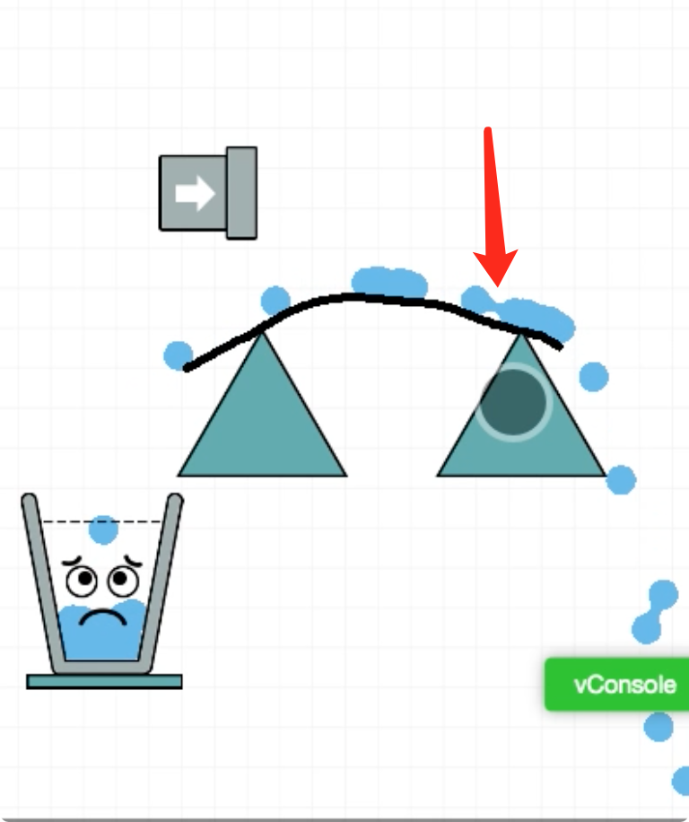

## 《欢乐水杯》的核心实现（一）

这是一款老游戏了，相信不少人都玩过。因为游戏模块多，所以就分章节来聊聊这种游戏的实现思路。

游戏**基本玩法**：玩家通过滑动屏幕划线，将水引入水杯，水装满了杯子就通关。


如上图所示，左上水管是水的源头，箭头表示流动方向。

杯子是目标位置，水滴要落到杯中，且要装满。

可以在屏幕上画线，将水引入到杯中。

本期重点是讲下如何模拟下流体的水。

水滴，重点还是要用**物理引擎**来模拟实现。因为从高处落下，天然的物理效果，用物理引擎的话就不用我们自己去计算下落路径。

为了简化逻辑，就用圆形来模拟水滴。创建节点，添加物理组件，设置碰撞编辑和物理等参数。

```javascript
var waterNode = new cc.Node("water" + waterCount++);
waterNode.position = cc.v2(0, 50 * Math.random()); // 随机Y坐标
waterNode.group = "water";

// 添加刚体和物理圆形碰撞器
var rigidBody = waterNode.addComponent(cc.RigidBody);
var circleCollider = waterNode.addComponent(cc.PhysicsCircleCollider);
circleCollider.radius = 12;
circleCollider.tag = 111;
circleCollider.friction = 0;
// 设置重力和速度
rigidBody.gravityScale = 3.5;
rigidBody.type = cc.RigidBodyType.Dynamic;
```

这样就可以批量创建一批水滴。但是用了物理效果的水滴，不会重叠，看上去的效果是小圆球，一点都不像是水，所以需要优化下。

设计一个函数计算两个圆形之间的光滑连接路径，然后再将这路径的闭合图形填充一样的颜色，那么整体效果就会接近水，模拟水的流体效果。具体来说，这个函数可以用于创建流体动态效果、模拟液体的流动，生成柔和的形状连接。

### 工作原理概述：

1. **输入参数**：

   * 两个圆形的半径。

   * 两个圆形的中心位置。

   * 选项参数 ：控制光滑度的系数。

2. **计算距离和角度**：

   * 函数首先计算两个球体中心之间的距离 (`i`) 以及其他一些必要的角度和参数。

3. **条件判断**：

   * 如果两个球体之间的距离大于它们的半径和，则返回 `null`，表示没有连接。

4. **计算连接路径**：

   * 通过三角函数和向量运算，计算出连接两个球体的四个控制点，这些控制点用来生成光滑的贝塞尔曲线。

5. **返回结果**：

   * 返回一个对象，包含两个球体的中心位置和控制点，这些可以用于绘制连接的路径。

得到路径后，填充路径就行。

```javascript
graphics.moveTo(metaballPath.pos1.x, metaballPath.pos1.y);
graphics.bezierCurveTo(
    metaballPath.con1.x, metaballPath.con1.y,
    metaballPath.con3.x, metaballPath.con3.y,
    metaballPath.pos3.x, metaballPath.pos3.y
);
graphics.lineTo(metaballPath.pos4.x, metaballPath.pos4.y);
graphics.bezierCurveTo(
    metaballPath.con4.x, metaballPath.con4.y,
    metaballPath.con2.x, metaballPath.con2.y,
    metaballPath.pos2.x, metaballPath.pos2.y
);
graphics.lineTo(metaballPath.pos1.x, metaballPath.pos1.y);
graphics.fill();
```

最后的效果如下：

两个球之前黏连处就是模拟出来的路径。
<center></center>

视频效果如下

欢迎关注我的公众号【入门游戏开发】，获取更多游戏开发知识和游戏源码，手把手教你做游戏。         
<center></center>
