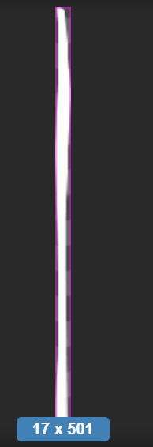

水排序是一款益智类的小游戏，前两年大热，游戏的主要目标是将不同颜色的水倒入对应颜色的水杯中，通过移动水的位置来达到排序的目的。玩到这个游戏的时候还挺好奇倒水这个过程到底是怎么实现的，说简单也非常简单，但也涉及到一些数学计算，本期就来扒一扒这里面的细节。

## 核心玩法演示

开始之前先看下最后的效果，虽说不是倒水过程很逼真，但已经有模有样。


## 玩法逻辑拆解

在写代码之前先拆解下这个玩法的一些基本组成部分。


* 游戏由多个不同颜色的水和水杯组成

* 多个不同颜色水混合在一个水杯里

* 需要通过移动水的位置，倒入正确颜色的桶中，最终实现使每个杯子都只包含一种颜色的水

* 倒水的颜色必须是与杯中顶部水颜色一致

* 水杯有上限，满了就不能倒了

* 倒水是一个杯减少，一个杯增加


所以在游戏中，需要定义3个类：

* 杯子：长度属性

* 水：颜色、高度属性

* 流动的水：长度属性




## 遮罩的妙用

水这里是简单用一个单纯色块来模拟，要实现杯子装水的效果，用遮罩就能满足。


给容器节点添加一个mask组件，类型选图片，然后选杯子的纹理。要是不设置遮罩就是另外一个效果了。


## 实现难点

实现的难点我想了下主要有以下两个方面，一个是杯子倒出水，一个是要接水，尤其是倒出去要怎么模拟才尽量真实。首先杯子在倒水的过程中要倾斜，这个好办，给杯子设定一个旋转角度就行，角度随着倒水越多而越大，最后要与另外一个杯子成 90 角。另外需要注意是杯中的水也得跟着一起倾斜，而且最上面的水高度要不断减少。总体效果如下图所示。


如果颜色断层了，那么就终止倒水。倒水的过程其实就是遍历容器子节点（水的高度），逐渐减少就行。


另外一个问题就是水柱效果，就是水在倒入过程中的样子，这个可以用一长条状来模拟水柱。只要改变长度就行，刚开始倒水是从 0 不断变长，最后水柱又逐渐减为 0。


这里水柱的属性要设置为filled，因为改变高度是从端到另外一端，用fiilled模式更好处理，改变fillRange就行。


```javascript
// 设置水滴结束
        this.setDropletEnd = setTimeout(function () {
            // 定义水滴动画函数
            self.droplet_func = function () {
                if (dropletSprite.fillStart >= 1) {
                    self.unschedule(self.droplet_func);
                    self.droplet.active = false;
                    dropletSprite.fillStart = 0;
                }
                dropletSprite.fillStart += 0.065;
            };
            // 执行水滴动画计划任务
            self.schedule(self.droplet_func);
        }, 600 * number + (number === 4 ? 2000 : number === 3 ? 1000 : number === 2 ? 500 : 250));
```


接水的杯子好处理，主要是水的高度增加就行。


## 游戏体验地址

微信扫二维码体验


欢迎关注我的公众号，获取更多游戏开发知识和游戏源码，手把手教你做游戏。         

