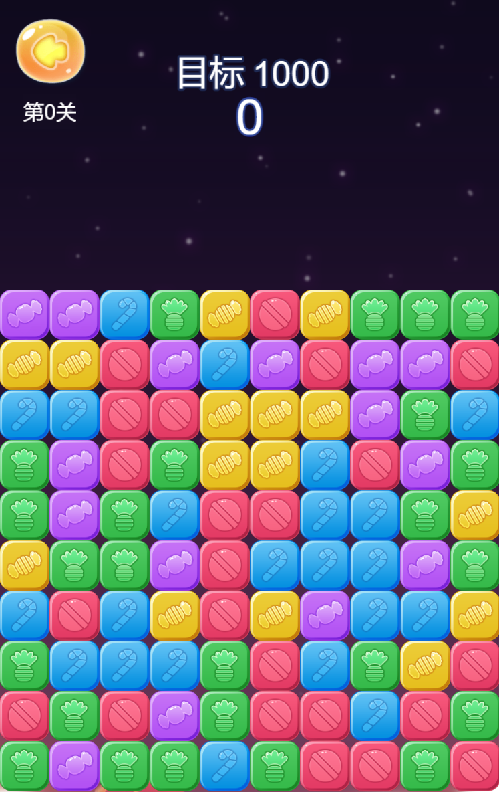
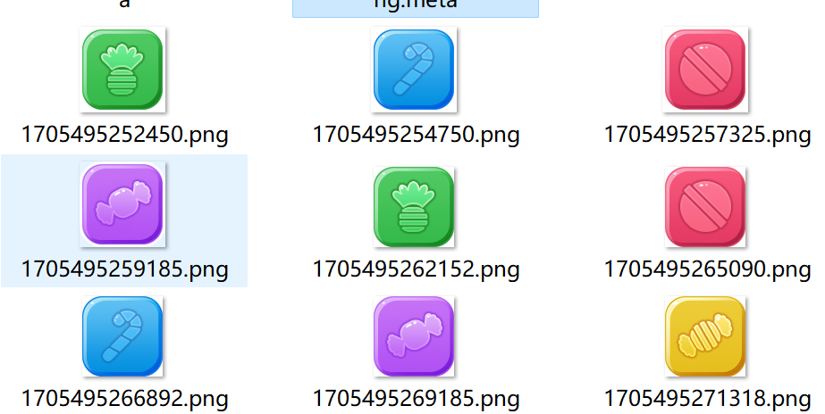
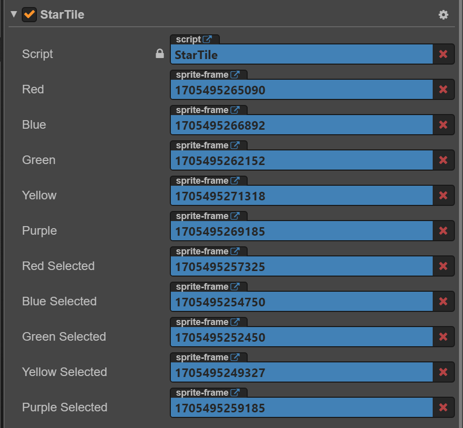

# 消灭星星小游戏源码和实现指南
<center></center>


今天要分享的是消灭星星如何开发，这种消除游戏算是非常简单的一种类型。消灭星星游戏是一种简单而有趣的游戏类型，我会详细介绍如何开发一款消灭星星游戏。


## 算法逻辑

消灭星星游戏的算法涉及到多个方面，包括星星的生成、消除规则、玩家操作的响应等。以下是一些会用到的算法：


1. **星星生成算法：**&#x20;

   * 随机生成：在游戏开始或关卡切换时，随机生成星星的位置和属性，属性主要是类型，不同类型可以设置不同的星星颜色。

   * 规定生成：按照一定的规则，例如在特定位置生成特殊类型的星星，或者确保每个生成的星星都能够被消除。

我这里采用比较简单的方式，地图采用10\*10的二维数组，作为星星存放的位置，每个星星的宽度是75\*75。一共有5种颜色类型的星星。

<center></center>

生成逻辑也简单粗暴，直接看代码，颜色类型是随机的，初始化填满地图，10\*10，然后缓存到一个对象上供后面使用，实例化的starTile父元素是容器。

```javascript
 function initializeStarTiles() {
    for (var col = 0; col < this.iTileCols; col++) {
        this.pMatriColTile[col] = [];

        for (var row = 0; row < this.iTileRows; row++) {
            var starTile = cc.instantiate(this.starTilePrefab);
            starTile.parent = this.elementLayer;

            var tileComponent = starTile.getComponent(_);
            tileComponent.setColRow(col, row);

            var randomColorType = parseInt(5 * Math.random());
            tileComponent.setColorType(randomColorType);

            if (!this.starTileSize) {
                this.starTileSize = starTile.getContentSize();
            }

            starTile.setPosition(this.calcStarTilePos(col, row));
            this.pMatriColTile[col][row] = starTile;
        }
    }
}
```

设置颜色类型的时候，顺便设置一下对应颜色的纹理，预制体的纹理如下：

<center></center>


* **星星消除规则：**

  * 相邻匹配：判断星星是否相邻，如果相邻并符合消除规则（如两个或以上相同颜色的星星相连），则进行消除。

  * 检测连锁反应：消除后，检测是否形成新的匹配，从而触发连锁反应，可以有也可以没有，有的话游戏的节奏感会更好。

我没有做深入的连锁反应逻辑处理，只做了简单的相邻匹配，这个算法比较简单，就是与当前选择的星星上下左右的星星比较颜色，如果一样则可以被消除。采用递归算法即可简单实现，具体可以参考下面的代码：

```javascript
traversalTiles: function (o, e, t) {
    var curspriteTile = this.pMatriColTile[o][e];
    if (curspriteTile) {
        if (!t) {
            this.starTileRemove.push(curspriteTile)
        }
        // 上下左右依次查询
        this.findSameTile(o, e + 1, curspriteTile)
        this.findSameTile(o, e - 1, curspriteTile)
        this.findSameTile(o + 1, e, curspriteTile)
        this.findSameTile(o - 1, e, curspriteTile)
    } else {
        cc.log("curspriteTile is null!");
    }
}

findSameTile: function (r, e, t) {
    if (!this.pMatriColTile[r] || !this.pMatriColTile[r][e]) {
        return false;
    }

    var currentTile = this.pMatriColTile[r][e];
    
    if (t && currentTile && t != currentTile && !this.connectContain(currentTile)) {
        var tileComponentA = currentTile.getComponent(StarTile);
        var tileComponentB = t.getComponent(StarTile);

        if (tileComponentA.getColorType() == tileComponentB.getColorType()) {
            cc.log("x * y", r, e);
            this.starTileRemove.push(currentTile);
            tileComponentA.setSelected(true);
            tileComponentB.setSelected(true);
            this.traversalTiles(r, e, t); // 如果找到了继续遍历查询

            return true;
        }
    }

    return false;
}
```

* **玩家操作响应：**

  * 触摸或点击检测：检测玩家触摸或点击的位置，确定选择的星星。这个处理比较简单，将手指坐标转换为星星的行列位置

```javascript
    onTouchBegin: function (event) {
        var e = Math.floor;
        var touchPos = this.elementLayer.convertTouchToNodeSpace(event.touch);
        var col = e(touchPos.x / this.starTileSize.width);
        var row = e(touchPos.y / this.starTileSize.height);
        console.log("onTouchBegin pos[%d * %d]", row, col);
        this.eliminateFlow(col, row);
    }
```

* **游戏结束判定逻辑：**

  * 达到目标分数：如果玩家在规定的步数或时间内达到目标分数，则游戏胜利。

  * 检测无法移动：如果没有可消灭的星星，判定游戏失败。

遍历所有星星，判断是否还能消除，这个逻辑可以每一帧都检测一次，在update生命周期中调用。目标分数计算很容易，消灭星星可以得分，然后对比当前关卡分数即可。

```javascript
checkGameResult: function () {
    for (var col = 0; col < this.iTileCols; col++) {
        if (this.pMatriColTile[col]) {
            for (var row = 0; row < this.iTileRows && this.pMatriColTile[col][row]; row++) {
                var currentTile = this.pMatriColTile[col][row];
                var currentColor = currentTile.getComponent(_).getColorType();

                // 四个方向的位置
                var positionsToCheck = [
                    cc.Vec2(col + 1, row),
                    cc.Vec2(col - 1, row),
                    cc.Vec2(col, row - 1),
                    cc.Vec2(col, row + 1)
                ];

                // 遍历检测
                for (var index = 0; index < positionsToCheck.length; index++) {
                    var position = positionsToCheck[index];
                    if (
                        this.pMatriColTile[position.x] &&
                        this.pMatriColTile[position.x][position.y] &&
                        this.pMatriColTile[position.x][position.y].getComponent(_).getColorType() == currentColor
                    ) {
                        // 有颜色相同说明还能消除
                        return false;
                    }
                }
            }
        }
    }
    // 否则就结束了
    return true;
},
```

其他的辅助道具或者场景就不做深入介绍，实现其他也比较简单，点击下面游戏（设置为手机模式）。

https://wxgame.fun/static/game/clear-star/


欢迎关注我的公众号，获取更多游戏开发知识和游戏源码，手把手教你做游戏。         

<center></center>