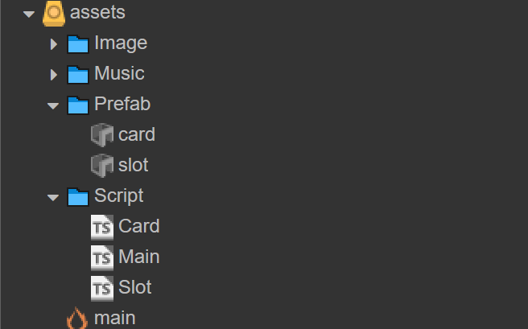

# 超级解压馆源码和核心玩法解析
今天跟大家分享一个热门游戏的核心玩法实现，那就是曾经很火，现在也很火的超级解压馆。超级解压馆的实现思路跟纸牌接龙有点像，为什么这么说，发牌这个逻辑基本差不多，给N个位置发牌，牌也可以挪动，但都有条件规则限制。然后是合成，颜色对了，数量满足条件就消除。而纸牌接龙则是花色一条龙即可完成目标。要说这个游戏的主要爽点在于音效和振动以及卡牌的收发动效，真是戳到了玩家的爽点。

本期就来深度拆解超级解压馆实现逻辑。还是老规矩，按模块分解游戏玩法。那么实现引擎还是Cocos Creator。这个游戏的核心有以下几个组成部分：

* 槽位

* 卡牌

* 发牌和合并卡牌



## 1、槽位

一共12个槽位，三行四列，当然这个你可以自己决定多少。这种规则布局本能反应就是要用Cocos Creator的Layout组件的Grid布局来实现。那么槽位当然是要抽象为预制体Prefab，方便复用逻辑。每个槽位都有自己的坐标，那么发牌就是给槽位添加卡牌，发到对应的槽位就行，那重点是槽位预制体的实现。如下图：卡槽有四个子节点，lock锁的标志，videoAd视频广告标志，video是否可以合并标志，cards存放卡牌容器。slot本身负责根据状态切换纹理：stateFrame。


槽位属性状态

* 已解锁，还可以细分已满，未满。

* 未解锁，未解锁还包含看广告解锁，远期可解锁，每合并升级一个等级解锁一个槽位。

超级解压馆设计每个槽位能放10个卡牌，我也照抄。这里给槽位一个cards属性，卡牌的设计是先进后出，天然适合用栈实现。每个卡片Y坐标错开一定的像素才能有堆叠效果，取决于卡牌的大小，这里设定为18像素。为了方便坐标统一方向，这里把槽位的Y方向锚点设置为1，子元素从顶部开始放置。


槽位的几个方法

#### 点击选中

选中槽位卡牌，遍历栈，遇到颜色不一致的卡牌就停止。设置当前选中的卡牌状态动画。标记槽位为选中状态。

```javascript
// 选择卡片
selectCards(){
    let tempCards = []
    let lastCardNum = null
    for(let i = this.cards.length - 1; i >= 0; i--){
        let card = this.cards[i]
        // 卡牌颜色类型相等，或者有空槽的情况
        if(lastCardNum === null || lastCardNum === card.getComponent(Card).getNum()){
            tempCards.push(card)
            lastCardNum = card.getComponent(Card).getNum()
        }else{
            break; // 遇到不一样的，中断循环
        }
    }

    tempCards.forEach(node => {
        node._originY = node.y; // 临时存储，因为选择后可能又不选择，要还原位置
        node.y += 10;
        this.setSelectAnimation(node); // 上下浮动的动画
    })
    this.tempSelectCards = tempCards;
}
```


https://github.com/iamaddy/minigame-developer/assets/3387191/466ccdbe-dbe6-4166-9467-1be05bf66dbb


#### 入栈

往cards中push卡牌，并且新增卡牌的Y坐标新增18像素。

```javascript
addCards(position, cardType, config, finishCallback){
    let card = cc.instantiate(this.cardPrefab) // 卡牌预制体
    let cardScript = card.getComponent(Card)
    cardScript.setNum(cardType); // 设置卡牌类型

    card.parent = this.cardsNode; // 入槽
    cardScript._originzIndex = card.zIndex;
    card.zIndex = 1000;// 暂时提高层级，可能存在遮挡卡牌
    let targetPosition = cc.v2({ x: 0, y: config.targetY })
    // 很关键，坐标转换
    let localPos = this.cardsNode.convertToNodeSpaceAR(position);
    card.setPosition(localPos);
    

    let moveDuration = .5
    let moveto = cc.moveTo(moveDuration, targetPosition);
    let delayAction = cc.delayTime(config.delay);
    // 创建一个回调动作，当动作执行完毕后调用指定的回调函数
    let callbackAction = cc.callFunc(() => {
        this.cards.push(card)
        card.zIndex = cardScript._originzIndex;
        finishCallback && finishCallback();
    }, this);

    // 将两个动作按顺序执行
    let sequenceAction = cc.sequence(delayAction, moveto , callbackAction);
    card.runAction(sequenceAction);
}
```

比较核心的一点就是移动的动画，涉及到坐标转化。因为这里card已经指定parent为cardsNode，那card起始坐标是从发牌按钮开始。那么可以先获取发牌按钮的世界坐标，再将这个世界坐标转到cardsNode的本地坐标，即可完成从发牌点到卡槽位置的移动。

```javascript
let position = this.addNewCardsButton.parent.convertToWorldSpaceAR(this.addNewCardsButton.position)
```

https://github.com/iamaddy/minigame-developer/assets/3387191/b1978411-7616-4ace-8075-3ca2e4ceed2a


#### 出栈

cards数组pop出来，从槽位移出，放入新的槽位。这里的逻辑比较简单，就是临时选中的卡牌依次出栈就行。

#### 卡牌移动

最复杂的逻辑是卡牌的移动，如果已经选中其他槽位，并且点击的目标槽位顶部卡牌颜色匹配则可以移动，否则不可移动。移动的逻辑如下，旧的槽位选中卡牌出栈，并且在新的槽位入栈。这里可以加一个动画，每个卡牌延迟一定时间移动，设置一个移动的Action，目标位置可以通过转换成世界坐标计算得到。

```javascript
checkCanMove(){
    // 遍历槽位，找出可以合并的
    let allSlotNodes = this.node.parent.children
    for(let i = 0; i < allSlotNodes.length; i++){
        if(this.node === allSlotNodes[i]){
            continue
        }
        let slotCom = allSlotNodes[i].getComponent(Slot);
        // 卡槽是否选中
        if(slotCom.isSelect){
            let lastCardNum = this.getLastCardNum()
            // 颜色要一样
            if(slotCom.getLastCardNum() === lastCardNum || 
                lastCardNum === -1){
                // 已经满了，也不能移动
                if(this.cards.length >= this.totalCardCount){
                    return false
                }
                // 真正的移动逻辑
                this.moveCardsToNewSlot(allSlotNodes[i])
                return true
            }else{
                // shake error
            }
        }
    }
    return false
}
```

```javascript
moveCardsToNewSlot(originSlotNode){
    // originSlotNode是待移动的槽位
    let slot = originSlotNode.getComponent(Slot);
    let cardLen = this.cards.length;
    let targetY = cardLen ? this.cards[cardLen - 1].position.y : this.startY;
    let index = 0;
    let delay = 0.05
    let len = slot.tempSelectCards.length
    // 待移动的槽位层级要最高，否则会出现遮挡
    slot._originzIndex = originSlotNode.zIndex;
    originSlotNode.zIndex = 1000;
    // 能移动的卡牌的数量
    let canMoveCardCount = this.totalCardCount - cardLen;
    // 加起来的数量不能超出总数
    while(slot.tempSelectCards.length &&
        index < canMoveCardCount){
        // 出栈
        let card = slot.tempSelectCards.shift();
        card.stopAllActions() // 停止之前的上下浮动动画
        let y = targetY - (len - index) * this.offsetY; // 目标位置
        let that = this;
        (function(index){
            // 开始移动
            that.moveAction(card, new cc.Vec2(0, y), delay * index, () => {
                // 全部移除后还原槽位的zIndex
                if(index + 1 === len || index + 1 === canMoveCardCount){
                    originSlotNode.zIndex = slot._originzIndex;
                }
            })
        })(index);
        index++;
        // 删除卡牌
        slot.cards.splice(slot.cards.indexOf(card), 1) 
    }
    slot.isSelect = false;
    // 如果tempSelectCards有剩余，也恢复状态
    slot.tempSelectCards.forEach(node => {
        node.stopAllActions()
        node.y = node._originY;
    })
    // 清空tempSelectCards 
    slot.tempSelectCards = [];
}
```


https://github.com/iamaddy/minigame-developer/assets/3387191/bfb029f6-21c7-4ff0-adab-c7f00758191e


## 2、卡牌预制体

卡牌相对简单一点，有10种类型，1-10，用不同的颜色表示即可，提供一个setNum和getNum的方法。


```javascript
getNum(){
    return this.num
}
setNum(num){
    this.num = num
    // 同时改变纹理
    this.numSprite.spriteFrame = this.numSpriteFrames[num - 1]
    this.node.getComponent(cc.Sprite).spriteFrame = this.cardSpriteFrames[num - 1]
}
```

## 3、卡牌发放/合并逻辑


遍历已经解锁的槽位，判断当前槽位的空间长度，根据剩余可用长度随机派发1-2个卡牌。这里也用到了卡牌预制体，实例化后将从发放按钮位置移动到具体的卡槽位置。起点是按钮的世界作为转为槽位的本地坐标，终点是槽位顶部的位置加上偏移量，动画完成后完成入栈，这样就完成了发牌逻辑。

合并逻辑就更简单，选中槽位，如果满足10个颜色一致，就可以进行合并，销毁已有的卡牌，然后合并成2个下一等级的卡牌。加上一个动画效果，每个卡牌延迟0.1秒消除，配合音效和震动，给用户增加解压爽点。


https://github.com/iamaddy/minigame-developer/assets/3387191/88ee042f-e0e0-46b1-90b9-1c4be08cccca


```javascript
mergeCards(){
    let children = this.cardsNode.children;
    // 不满足
    if(children.length < 10){
        return
    }
    // 颜色存在不一样的
    let firstNum = children[0].getComponent(Card).getNum();
    for(let i = 1; i < children.length; i++){
        if(children[i].getComponent(Card).getNum() !== firstNum){
            return
        }
    }
    // 播放音频
    cc.audioEngine.playEffect(this.mergeAudioClip, false);
    // 隔一定时间销毁一个子节点
    let delay = 0.05 * children.length
    let moveTime = 0.01
    for(let i = 0; i < children.length; i++){
        let move = cc.scaleTo(moveTime, 0);
        let delayAction = cc.delayTime(delay - 0.05 * i);
        let child = children[i]
        let callbackAction = cc.callFunc(() => {
            child.destroy();
        }, this);
        let sequenceAction = cc.sequence(delayAction, move, callbackAction);
        child.runAction(sequenceAction);
    }
    // 还原状态
    setTimeout(() => {
        this.cardsNode.removeAllChildren()
        this.cards = []
        this.tempSelectCards = []
        this.isSelect = false;
    }, (delay + moveTime * children.length) * 1000)
}
```

核心玩法到这里就差不多了，一共400行代码可以完成，可以扫码体验下，也可以点击[链接](https://www.wxgame.fun/static/game/chaojijieyaguang/)。剩下的就是解锁更多槽位的辅助逻辑，有兴趣的可以自己去探索。

欢迎关注我的公众号，获取更多游戏开发知识和游戏源码，手把手教你做游戏。


